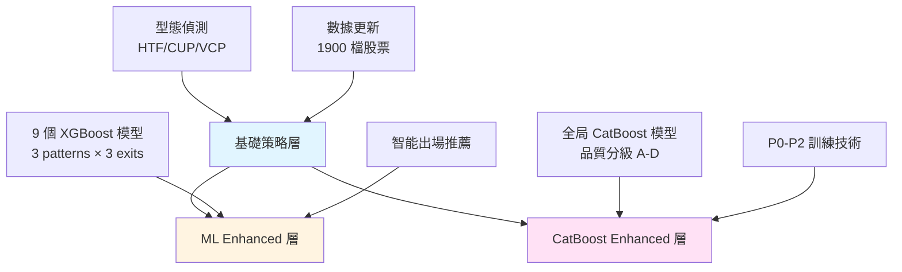

# 台股 ML-Enhanced 交易系統

基於技術型態識別與機器學習的自動化台股交易系統，整合三層智能架構：基礎策略、ML Enhanced 和 CatBoost Enhanced。

## 🎯 系統概覽

本系統每日自動掃描台股市場 (TWSE + TPEX 約 1900 檔)，識別 HTF/CUP/VCP 技術型態，並透過兩套機器學習模型過濾高品質訊號。

### 三層架構



### 核心優勢

- ✅ **三層智能過濾**: 基礎策略 → ML → CatBoost 層層把關
- ✅ **智能出場推薦**: 自動選擇最佳出場策略 (Fixed R=2.0/3.0 或 Trailing)
- ✅ **優異績效**: 年化報酬 156%, Sharpe 2.62, 勝率 74%
- ✅ **全自動化**: 每日 19:00 掃描 + 每週日 02:00 模型更新
- ✅ **雙模型驗證**: XGBoost 9 模型 + CatBoost 全局模型互相驗證

## 📚 文件導航

### 快速開始
- **[系統架構](file:///Users/sony/ml_stock/stock/docs/01_系統架構.md)** - 理解整體架構與資料流
- **[自動化排程](file:///Users/sony/ml_stock/stock/docs/02_自動化排程.md)** - Crontab 設定與執行時程

### 策略與系統
- **[型態策略](file:///Users/sony/ml_stock/stock/docs/03_型態策略.md)** - HTF/CUP/VCP 定義與邏輯
- **[基礎策略系統](file:///Users/sony/ml_stock/stock/docs/04_基礎策略系統.md)** - main.py 原始掃描流程
- **[ML Enhanced 系統](file:///Users/sony/ml_stock/stock/docs/05_ML_Enhanced系統.md)** - XGBoost 9 模型系統
- **[CatBoost Enhanced 系統](file:///Users/sony/ml_stock/stock/docs/06_CatBoost_Enhanced系統.md)** - CatBoost 全局模型系統

### 技術深入
- **[回測引擎](file:///Users/sony/ml_stock/stock/docs/07_回測引擎.md)** - 回測邏輯與績效驗證
- **[數據管道](file:///Users/sony/ml_stock/stock/docs/08_數據管道.md)** - 數據來源與處理流程
- **[開發指南](file:///Users/sony/ml_stock/stock/docs/09_開發指南.md)** - 實驗與優化指南

### 技術文件
- **[ML Enhanced 技術細節](file:///Users/sony/ml_stock/stock/ml_enhanced/ML_SYSTEM.md)** - 9 模型訓練與特徵工程
- **[CatBoost Enhanced 技術細節](file:///Users/sony/ml_stock/stock/catboost_enhanced/CATBOOST_SYSTEM.md)** - P0-P2 訓練技術

## ⚡ 快速執行

### 每日掃描 (自動執行於 19:00-19:10)

```bash
cd /Users/sony/ml_stock/stock

# 基礎策略掃描 (19:00)
poetry run python main.py

# ML Enhanced 掃描 (19:05)
poetry run python ml_enhanced/daily_ml_scanner.py

# CatBoost Enhanced 掃描 (19:10)
poetry run python catboost_enhanced/daily_ml_scanner.py
```

### 每週模型重訓 (自動執行於週日 02:00)

```bash
# ML Enhanced 重訓
poetry run python ml_enhanced/weekly_retrain.py

# CatBoost Enhanced 重訓 (含兩模型對比)
poetry run python catboost_enhanced/weekly_retrain.py
```

## 📊 每日報告位置

### 基礎策略報告
- **路徑**: `daily_tracking_stock/YYYY-MM-DD/daily_summary.md`
- **內容**: 所有 HTF/CUP/VCP 型態訊號、過去一週彙整、Top 3 策略

### ML Enhanced 報告
- **路徑**: `ml_enhanced/daily_reports/YYYY-MM-DD/ml_daily_summary.md`
- **內容**: ML 推薦訊號 (≥0.4)、智能出場建議、過去一週高品質訊號

### CatBoost Enhanced 報告
- **路徑**: `catboost_enhanced/results/catboost_daily_summary_YYYY-MM-DD.md`
- **內容**: A/B 級推薦訊號、歷史績效整合、過去一週追蹤

## 📈 系統績效 (回測驗證)

### Top 3 策略組合

| 排名 | 策略 | 年化報酬 | Sharpe | 勝率 | 交易次數 |
|------|------|----------|---------|------|----------|
| 🥇 | HTF Fixed R=2.0 (ML 0.4) | 156.0% | 2.59 | 60.2% | 425 |
| 🥈 | HTF Fixed R=2.0 (ML 0.5) | 145.7% | 2.62 | 62.8% | 374 |
| 🥉 | CUP Fixed R=3.0 (ML 0.5) | 129.7% | 2.09 | 74.4% | 246 |

### 回測參數
- 初始資金: 100 萬
- 倉位大小: 總資產 10%
- 最大持倉: 10 檔
- 允許 Pyramiding (同股多次進場)
- 追蹤窗口: 30 天

詳細回測邏輯請參考 [回測引擎文件](file:///Users/sony/ml_stock/stock/docs/07_回測引擎.md)。

## 🛠️ 系統需求

### 環境
- Python 3.11+
- Poetry (依賴管理)

### 主要套件
- Pandas, NumPy, Polars (數據處理)
- XGBoost, CatBoost, scikit-learn (機器學習)
- yfinance (數據來源)

### 安裝

```bash
cd /Users/sony/ml_stock/stock
poetry install
poetry shell
```

## 📂 專案結構

```
stock/
├── main.py                          # 基礎策略每日掃描入口
├── config.py                        # 系統配置
│
├── scripts/                         # 核心執行腳本
│   ├── update_daily_data.py         # 數據更新
│   ├── run_daily_scan.py            # 每日訊號掃描
│   ├── run_historical_analysis.py   # 歷史型態分析
│   └── run_backtest.py              # 回測引擎
│
├── src/                             # 核心邏輯模組
│   ├── strategies/                  # HTF, CUP, VCP 策略
│   ├── ml/                          # ML 共享模組 (特徵工程)
│   ├── utils/                       # 通用工具 (logger, data_loader)
│   ├── data/                        # 數據處理
│   └── crawlers/                    # 數據爬蟲
│
├── ml_enhanced/                     # ML Enhanced 系統
│   ├── daily_ml_scanner.py          # ML 每日掃描
│   ├── weekly_retrain.py            # ML 週訓練
│   ├── scripts/                     # 特徵準備、訓練、回測
│   ├── models/                      # 9 個 XGBoost 模型
│   └── ML_SYSTEM.md                 # ML 技術文件
│
├── catboost_enhanced/               # CatBoost Enhanced 系統
│   ├── daily_ml_scanner.py          # CatBoost 每日掃描
│   ├── weekly_retrain.py            # CatBoost 週訓練
│   ├── scripts/                     # 特徵準備、訓練、回測
│   ├── models/                      # CatBoost 全局模型
│   └── CATBOOST_SYSTEM.md           # CatBoost 技術文件
│
├── data/                            # 數據存放
│   ├── raw/daily_quotes/            # 原始股價數據
│   └── processed/                   # 處理後數據
│
├── daily_tracking_stock/            # 每日基礎報告
├── optimization/                    # 超參數優化
└── docs/                            # 系統文件 (01-09)
```

## ⚠️ 風險聲明

本系統僅供輔助分析使用，不構成任何投資建議。歷史績效不代表未來表現，股市投資有風險，請審慎評估。

---

**系統版本**: 3.0 (三層架構)  
**ML Enhanced**: v2.0 (9 模型 + 智能出場)  
**CatBoost Enhanced**: v1.0 (全局模型 + P0-P2)  
**最後更新**: 2025-11-23  
**系統狀態**: ✅ Production Ready
