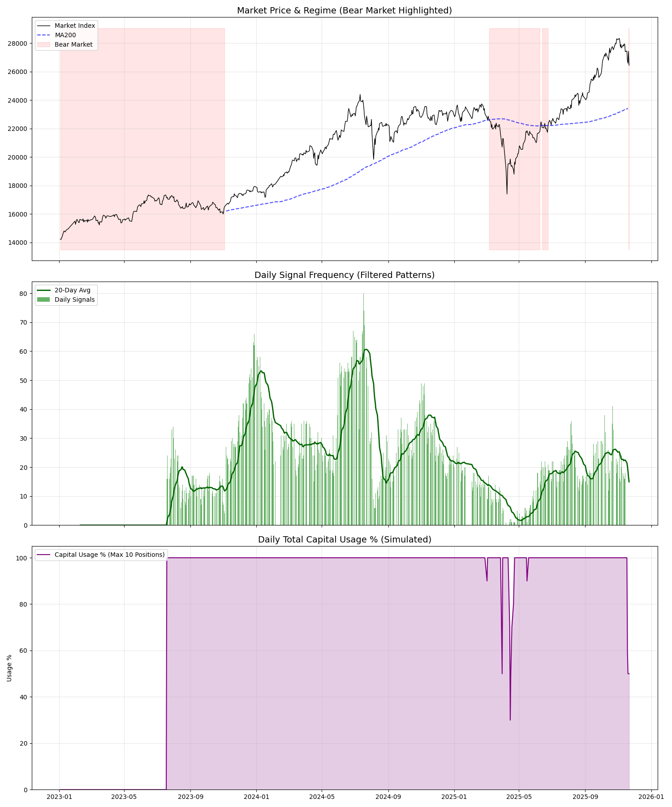

# 市場狀態分析：為何夏普比率（Sharpe）很高？

**生成時間**：2025-11-22 09:18:34.232399

## 1. 假設 (Hypothesis)
我們的假設是，該策略在市場低迷（熊市）期間會自然減少曝險，因為產生的突破訊號較少。這種「自然避險」機制可能解釋了為何會有高夏普比率和低回撤（Drawdown）。

## 2. 統計證據

| 指標 | 數值 |
|---|---|
| **總分析天數** | 697 |
| **牛市天數** | 426 (61.1%) |
| **熊市天數** | 271 (38.9%) |
| **平均每日訊號數 (牛市)** | **2104.77** |
| **平均每日訊號數 (熊市)** | **1119.44** |
| **牛市/熊市訊號比例** | **1.9x** |
| **相關性 (市場狀態 vs 訊號)** | 0.59 |

## 3. 分析發現

### ⚠️ 部分確認：適度減少
訊號數量有適度減少（1.9 倍），但並未完全枯竭（dry-up）。該策略在熊市中仍然會進行部分交易。

## 4. 視覺化分析

- **上方圖表**：市場指數（黑色），其中熊市時段以紅色高亮顯示。
- **中間圖表**：每日訊號計數。請注意綠色柱狀條在紅色區域（熊市）通常會減少。
- **下方圖表**：模擬曝險（活躍交易）。這顯示了您隨時間變化的「風險開啟 / 風險關閉 (Risk On / Risk Off)」概況。