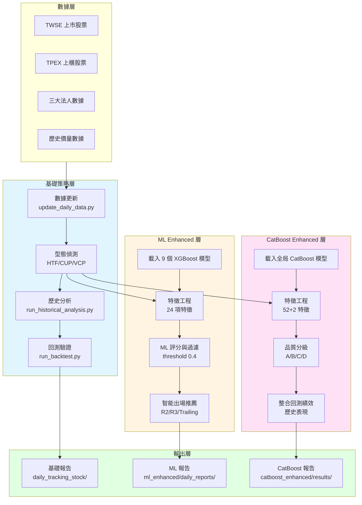
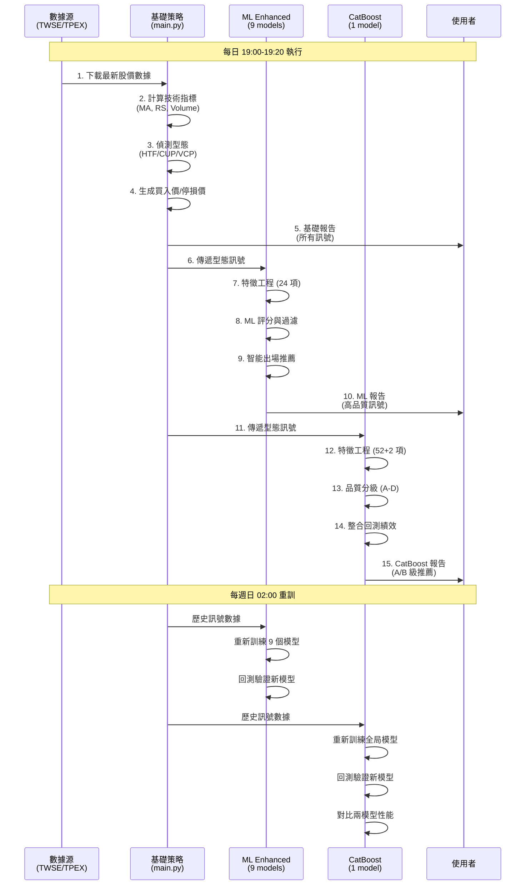

# 系統架構

本文件說明台股 ML-Enhanced 交易系統的整體架構、資料流與各模組職責。

## 整體架構圖

## 三層架構說明

### 第一層：基礎策略層

**位置**: `main.py` + `src/` + `scripts/`

**職責**:
- 每日自動更新約 1900 檔股票數據 (TWSE + TPEX)
- 識別技術型態: HTF (High Tight Flag)、CUP (Cup with Handle)、VCP (Volatility Contraction Pattern)
- 計算買入價、停損價、Grade 評分
- 執行歷史分析與回測驗證
- 生成基礎訊號報告

**核心邏輯**:
1. 數據更新: 爬取最新股價、計算技術指標 (MA、RS Rating 等)
2. 型態掃描: 對每檔股票檢查是否符合型態條件
3. 訊號生成: 產出買入價、停損價、當前狀態
4. 回測驗證: 使用歷史數據驗證策略績效

**輸出**: `daily_tracking_stock/YYYY-MM-DD/daily_summary.md`

詳細流程參考 [基礎策略系統文件](file:///Users/sony/ml_stock/stock/docs/04_基礎策略系統.md)。

---

### 第二層：ML Enhanced 層

**位置**: `ml_enhanced/`

**職責**:
- 使用 9 個 XGBoost 模型 (3 patterns × 3 exit_modes) 過濾訊號
- 為每個訊號預測最佳出場策略
- 計算 ML 品質分數 (0-1)
- 只推薦高品質訊號 (ML ≥ 0.4)

**架構特色**:
- **獨立模型設計**: 每個 pattern-exit 組合訓練獨立模型
- **智能出場**: 自動推薦 Fixed R=2.0、R=3.0 或 Trailing 1.5R
- **特徵工程**: 24 項特徵 (型態品質、動能、成交量、RSI、趨勢等)
- **每週重訓**: 使用最新數據更新模型權重

**核心流程**:
1. 載入基礎層偵測到的型態訊號
2. 提取 24 項 ML 特徵
3. 對每個訊號預測 3 種出場策略的成功機率
4. 選擇最高機率的出場策略
5. 過濾 ML 分數 < 0.4 的訊號
6. 生成 ML 推薦報告

**輸出**: `ml_enhanced/daily_reports/YYYY-MM-DD/ml_daily_summary.md`

詳細邏輯參考 [ML Enhanced 系統文件](file:///Users/sony/ml_stock/stock/docs/05_ML_Enhanced系統.md)。

---

### 第三層：CatBoost Enhanced 層

**位置**: `catboost_enhanced/`

**職責**:
- 使用 1 個全局 CatBoost 模型預測訊號品質
- 將訊號分級為 A/B/C/D 四個等級
- 整合歷史回測績效數據
- 生成帶有性能預期的推薦清單

**架構特色**:
- **全局模型**: pattern_type 和 exit_mode 作為分類特徵
- **多分類任務**: 直接預測品質等級 (A/B/C/D)
- **進階訓練**: P0 基礎 + P1 Embargo + P2 樣本權重
- **性能整合**: 每個推薦訊號附帶該組合的歷史年化報酬、勝率、Sharpe

**核心流程**:
1. 載入基礎層偵測到的型態訊號
2. 提取 52 項數值特徵 + 2 項分類特徵
3. 使用 CatBoost 模型預測品質等級
4. 從回測結果匹配該組合的歷史績效
5. 只推薦 A/B 級訊號
6. 生成帶績效預期的推薦報告

**輸出**: `catboost_enhanced/results/catboost_daily_summary_YYYY-MM-DD.md`

詳細邏輯參考 [CatBoost Enhanced 系統文件](file:///Users/sony/ml_stock/stock/docs/06_CatBoost_Enhanced系統.md)。

---

## 資料流向圖

## 模組相依關係

### 共享模組 (`src/`)

**策略模組** (`src/strategies/`)
- `htf.py`: HTF 型態偵測邏輯
- `cup.py`: CUP 型態偵測邏輯
- `vcp.py`: VCP 型態偵測邏輯

**ML 模組** (`src/ml/`)
- `features.py`: ML 特徵工程函數 (基礎策略、ML Enhanced、CatBoost 共用)

**工具模組** (`src/utils/`)
- `logger.py`: 統一日誌系統
- `data_loader.py`: 數據載入工具

**數據模組** (`src/data/`)
- `institutional.py`: 三大法人數據處理
- `market_data.py`: 市場數據處理

### 執行腳本 (`scripts/`)

**數據更新**: `update_daily_data.py`
- 爬取 TWSE + TPEX 股價
- 計算技術指標 (MA20/50/150/200, Volume MA)
- 計算 RS Rating (相對強度)

**每日掃描**: `run_daily_scan.py`
- 對每檔股票執行型態偵測
- 生成訊號列表 (買入價、停損價、Grade)

**歷史分析**: `run_historical_analysis.py`
- 回溯歷史型態訊號
- 建立訓練數據集

**回測引擎**: `run_backtest.py` + `backtest_engine_v2.py`
- 模擬資金管理與進出場
- 計算績效指標 (年化報酬、Sharpe、勝率)

## 關鍵設計決策

### 為何三層架構？

**基礎策略層** ✓ 確保訊號完整性
- 不遺漏任何符合技術型態的股票
- 提供原始訊號作為 ML 訓練基礎

**ML Enhanced 層** ✓ 提升訊號品質
- 過濾低品質訊號，提高勝率
- 智能推薦出場策略，最大化每個訊號的潛力

**CatBoost Enhanced 層** ✓ 提供替代視角
- 全局模型捕捉 pattern-exit 交互作用
- 品質分級與績效預期幫助決策

### 為何需要兩套 ML 系統？

**ML Enhanced (XGBoost 9 模型)**:
- 優勢: 各組合獨立優化，細緻度高
- 適用: 了解各策略細節，追求極致優化

**CatBoost Enhanced (全局模型)**:
- 優勢: 學習跨組合規律，避免過擬合
- 適用: 快速決策，尋找最佳 pattern-exit 組合

兩者互補，提供交叉驗證。

## 相關文件

- [自動化排程](file:///Users/sony/ml_stock/stock/docs/02_自動化排程.md) - 各層執行時程
- [型態策略](file:///Users/sony/ml_stock/stock/docs/03_型態策略.md) - 型態偵測細節
- [基礎策略系統](file:///Users/sony/ml_stock/stock/docs/04_基礎策略系統.md) - 第一層詳細流程
- [ML Enhanced 系統](file:///Users/sony/ml_stock/stock/docs/05_ML_Enhanced系統.md) - 第二層詳細流程
- [CatBoost Enhanced 系統](file:///Users/sony/ml_stock/stock/docs/06_CatBoost_Enhanced系統.md) - 第三層詳細流程
- [回測引擎](file:///Users/sony/ml_stock/stock/docs/07_回測引擎.md) - 績效驗證邏輯
