# 自動化排程

本文件說明系統的 Crontab 自動化排程設定、執行時程與監控方法。

## Crontab 設定總覽

系統使用 5 個 cron job 實現全自動化運作：

| 時間 | 腳本 | 功能 | 執行頻率 |
|------|------|------|----------|
| 19:00 | `main.py` | 基礎策略掃描 | 每日 |
| 19:05 | `ml_enhanced/daily_ml_scanner.py` | ML Enhanced 掃描 | 每日 |
| 19:10 | `catboost_enhanced/daily_ml_scanner.py` | CatBoost 掃描 | 每日 |
| 02:00 | `ml_enhanced/weekly_retrain.py` | ML Enhanced 重訓 | 每週日 |
| 02:00 | `catboost_enhanced/weekly_retrain.py` | CatBoost 重訓 | 每週日 |

## 每日流程 (19:00-19:20)

### 執行時序圖



```mermaid
gantt
    title 每日自動化流程
    dateFormat HH:mm
    axisFormat %H:%M
    
    section 基礎策略
    數據更新           :19:00, 2m
    型態掃描           :19:02, 2m
    歷史分析           :19:04, 1m
    
    section ML Enhanced
    ML 掃描與評分      :19:05, 3m
    生成 ML 報告       :19:08, 1m
    
    section CatBoost
    CatBoost 掃描      :19:10, 4m
    生成推薦清單       :19:14, 1m
```

### 1. 基礎策略掃描 (19:00)

**Crontab 設定**:
```bash
0 19 * * * cd /Users/sony/ml_stock/stock && /Users/sony/.local/bin/poetry run python main.py >> /Users/sony/ml_stock/logs/original_scan.log 2>&1
```

**執行內容**:
1. 更新約 1900 檔股票數據 (`scripts/update_daily_data.py`)
2. 計算技術指標 (MA, RS Rating, Volume)
3. 掃描 HTF/CUP/VCP 型態 (`scripts/run_daily_scan.py`)
4. 執行歷史分析 (`scripts/run_historical_analysis.py`)
5. 運行回測驗證 (`scripts/run_backtest.py`)
6. 生成每日報告

**輸出位置**: `daily_tracking_stock/YYYY-MM-DD/daily_summary.md`

**預估時長**: 約 5 分鐘

### 2. ML Enhanced 掃描 (19:05)

**Crontab 設定**:
```bash
5 19 * * * cd /Users/sony/ml_stock/stock && /Users/sony/.local/bin/poetry run python ml_enhanced/daily_ml_scanner.py >> /Users/sony/ml_stock/logs/ml_enhanced_scanner.log 2>&1
```

**執行內容**:
1. 更新最新數據 (確保與基礎層同步)
2. 載入 9 個 XGBoost 模型
3. 對偵測到的型態進行 ML 評分
4. 為每個訊號推薦最佳出場策略
5. 過濾 ML 分數 < 0.4 的訊號
6. 掃描過去一週高品質訊號
7. 生成 ML 推薦報告

**輸出位置**: `ml_enhanced/daily_reports/YYYY-MM-DD/ml_daily_summary.md`

**預估時長**: 約 4 分鐘

### 3. CatBoost Enhanced 掃描 (19:10)

**Crontab 設定**:
```bash
10 19 * * * cd /Users/sony/ml_stock/stock && /Users/sony/.local/bin/poetry run python catboost_enhanced/daily_ml_scanner.py >> /Users/sony/ml_stock/logs/catboost_scanner.log 2>&1
```

**執行內容**:
1. 載入最新市場數據
2. 載入 CatBoost 全局模型
3. 對訊號進行品質分級 (A/B/C/D)
4. 從回測結果匹配歷史績效
5. 篩選 A/B 級推薦訊號
6. 載入過去一週推薦清單
7. 生成 CatBoost 推薦報告

**輸出位置**: `catboost_enhanced/results/catboost_daily_summary_YYYY-MM-DD.md`

**預估時長**: 約 5 分鐘

---

## 每週重訓流程 (週日 02:00)

### 執行時序圖



```mermaid
gantt
    title 每週模型重訓流程 (並行執行)
    dateFormat HH:mm
    axisFormat %H:%M
    
    section ML Enhanced
    準備特徵數據       :02:00, 15m
    訓練 9 個模型      :02:15, 30m
    執行回測驗證       :02:45, 20m
    
    section CatBoost
    準備特徵數據       :02:00, 15m
    訓練全局模型       :02:15, 25m
    執行回測驗證       :02:40, 20m
    比較兩模型性能     :03:00, 5m
```

### 4. ML Enhanced 重訓 (週日 02:00)

**Crontab 設定**:
```bash
0 2 * * 0 cd /Users/sony/ml_stock/stock && /Users/sony/.local/bin/poetry run python ml_enhanced/weekly_retrain.py >> /Users/sony/ml_stock/logs/ml_enhanced_retrain.log 2>&1
```

**執行內容**:
1. 準備 ML 特徵數據 (`ml_enhanced/scripts/prepare_ml_data.py`)
   - 載入歷史訊號
   - 提取 24 項特徵
   - 標註訓練標籤 (3 種出場方式的成功/失敗)
2. 訓練 9 個 XGBoost 模型 (`ml_enhanced/scripts/train_models.py`)
   - 3 patterns × 3 exit_modes = 9 models
   - 保存模型權重到 `ml_enhanced/models/`
3. 回測驗證 (`ml_enhanced/scripts/run_ml_backtest.py`)
   - 使用新模型回測歷史數據
   - 生成績效報告

**輸出**:
- 模型: `ml_enhanced/models/stock_selector_{pattern}_{exit}.pkl` (9 個)
- 特徵信息: `ml_enhanced/models/feature_info.pkl`
- 回測結果: `ml_enhanced/results/ml_backtest_final.csv`

**預估時長**: 約 60-90 分鐘

### 5. CatBoost Enhanced 重訓 (週日 02:00，並行)

**Crontab 設定**:
```bash
0 2 * * 0 cd /Users/sony/ml_stock/stock && /Users/sony/.local/bin/poetry run python catboost_enhanced/weekly_retrain.py >> /Users/sony/ml_stock/logs/catboost_retrain.log 2>&1
```

**執行內容**:
1. **並行訓練兩套模型**:
   - ML Enhanced: 執行上述流程 4
   - CatBoost Enhanced: 執行以下流程
2. 準備 CatBoost 特徵數據 (`catboost_enhanced/scripts/prepare_catboost_data.py`)
   - 載入歷史訊號
   - 提取 52 項數值特徵 + 2 項分類特徵
   - 標註品質等級 (A/B/C/D)
3. 訓練全局 CatBoost 模型 (`catboost_enhanced/scripts/train.py`)
   - 使用 P0-P2 訓練技術
   - 保存模型到 `catboost_enhanced/models/`
4. 回測驗證 (`catboost_enhanced/scripts/run_catboost_backtest.py`)
   - 使用新模型回測各組合
   - 生成分組績效報告
5. **性能對比分析**
   - 比較 ML Enhanced vs CatBoost Enhanced
   - 生成對比報告

**輸出**:
- 模型: `catboost_enhanced/models/catboost_global.cbm`
- 特徵信息: `catboost_enhanced/models/catboost_feature_info.pkl`
- 回測結果: `catboost_enhanced/results/backtest_by_group.csv`
- 對比報告: `catboost_enhanced/results/weekly_comparison_report.md`

**預估時長**: 約 60-90 分鐘

---

## 日誌管理

### 日誌位置

所有排程執行的日誌統一存放在 `/Users/sony/ml_stock/logs/`:

```
logs/
├── original_scan.log           # 基礎策略掃描
├── ml_enhanced_scanner.log     # ML Enhanced 掃描
├── catboost_scanner.log        # CatBoost 掃描
├── ml_enhanced_retrain.log     # ML 重訓
└── catboost_retrain.log        # CatBoost 重訓
```

### 日誌監控

**查看最新日誌**:
```bash
# 查看今日基礎掃描
tail -f /Users/sony/ml_stock/logs/original_scan.log

# 查看今日 ML 掃描
tail -f /Users/sony/ml_stock/logs/ml_enhanced_scanner.log

# 查看今日 CatBoost 掃描
tail -f /Users/sony/ml_stock/logs/catboost_scanner.log

# 查看最近重訓
tail -100 /Users/sony/ml_stock/logs/ml_enhanced_retrain.log
tail -100 /Users/sony/ml_stock/logs/catboost_retrain.log
```

**檢查執行狀態**:
```bash
# 檢查 crontab 設定
crontab -l

# 查看最近執行的 cron jobs (macOS)
log show --predicate 'process == "cron"' --last 1h
```

---

## 手動執行

如需手動執行任何排程任務:

### 每日掃描

```bash
cd /Users/sony/ml_stock/stock

# 基礎策略掃描
poetry run python main.py

# ML Enhanced 掃描
poetry run python ml_enhanced/daily_ml_scanner.py

# CatBoost Enhanced 掃描
poetry run python catboost_enhanced/daily_ml_scanner.py
```

### 每週重訓

```bash
cd /Users/sony/ml_stock/stock

# ML Enhanced 重訓
poetry run python ml_enhanced/weekly_retrain.py

# CatBoost Enhanced 重訓 (含性能對比)
poetry run python catboost_enhanced/weekly_retrain.py
```

---

## 故障排除

### 常見問題

**1. 數據更新失敗**

**症狀**: `original_scan.log` 顯示數據下載錯誤

**解決方法**:
- 檢查網路連線
- 確認 yfinance 套件版本
- 手動執行 `poetry run python scripts/update_daily_data.py` 查看詳細錯誤

**2. ML 模型載入失敗**

**症狀**: `ml_enhanced_scanner.log` 顯示模型文件不存在

**解決方法**:
- 確認 `ml_enhanced/models/` 目錄下有 9 個 `.pkl` 文件
- 執行重訓: `poetry run python ml_enhanced/weekly_retrain.py`

**3. CatBoost 模型載入失敗**

**症狀**: `catboost_scanner.log` 顯示模型載入錯誤

**解決方法**:
- 確認 `catboost_enhanced/models/catboost_global.cbm` 存在
- 執行重訓: `poetry run python catboost_enhanced/weekly_retrain.py`

**4. Cron Job 未執行**

**症狀**: 指定時間沒有生成報告

**解決方法**:
- 確認 crontab 設定: `crontab -l`
- 檢查系統時間是否正確: `date`
- 確認 cron 服務運行 (macOS 需在系統偏好設定允許)

### 緊急修復流程

如果自動化系統完全失效:

1. 檢查 crontab 設定是否正確
2. 手動執行各腳本確認功能正常
3. 查看日誌找出錯誤根因
4. 修復後重新設定 crontab

```bash
# 重新設定 crontab
crontab -e

# 貼上完整設定 (參考下方完整設定範本)
```

---

## 完整 Crontab 設定範本

```bash
# ════════════════════════════════════════════════════════════════
# 台股 ML-Enhanced 交易系統 - Crontab 設定
# ════════════════════════════════════════════════════════════════

# ════════════════════════════════════════════════════════════════
# 每日流程 (19:00 - 19:20)
# ════════════════════════════════════════════════════════════════

# [1] 19:00 - 原始策略掃描
0 19 * * * cd /Users/sony/ml_stock/stock && /Users/sony/.local/bin/poetry run python main.py >> /Users/sony/ml_stock/logs/original_scan.log 2>&1

# [2] 19:05 - ML Enhanced 掃描
5 19 * * * cd /Users/sony/ml_stock/stock && /Users/sony/.local/bin/poetry run python ml_enhanced/daily_ml_scanner.py >> /Users/sony/ml_stock/logs/ml_enhanced_scanner.log 2>&1

# [3] 19:10 - CatBoost 掃描
10 19 * * * cd /Users/sony/ml_stock/stock && /Users/sony/.local/bin/poetry run python catboost_enhanced/daily_ml_scanner.py >> /Users/sony/ml_stock/logs/catboost_scanner.log 2>&1


# ════════════════════════════════════════════════════════════════
# 每週日流程 (02:00)
# ════════════════════════════════════════════════════════════════

# [4] 02:00 - ML Enhanced 週期重訓
0 2 * * 0 cd /Users/sony/ml_stock/stock && /Users/sony/.local/bin/poetry run python ml_enhanced/weekly_retrain.py >> /Users/sony/ml_stock/logs/ml_enhanced_retrain.log 2>&1

# [5] 02:00 - CatBoost 週期重訓 (並行執行)
0 2 * * 0 cd /Users/sony/ml_stock/stock && /Users/sony/.local/bin/poetry run python catboost_enhanced/weekly_retrain.py >> /Users/sony/ml_stock/logs/catboost_retrain.log 2>&1
```

使用方法:
```bash
crontab -e  # 編輯 crontab
# 貼上上述內容
# 儲存並退出 (:wq)
crontab -l  # 驗證設定
```

---

## 相關文件

- [系統架構](file:///Users/sony/ml_stock/stock/docs/01_系統架構.md) - 理解三層架構
- [基礎策略系統](file:///Users/sony/ml_stock/stock/docs/04_基礎策略系統.md) - main.py 詳細流程
- [ML Enhanced 系統](file:///Users/sony/ml_stock/stock/docs/05_ML_Enhanced系統.md) - ML 掃描與重訓流程
- [CatBoost Enhanced 系統](file:///Users/sony/ml_stock/stock/docs/06_CatBoost_Enhanced系統.md) - CatBoost 掃描與重訓流程
