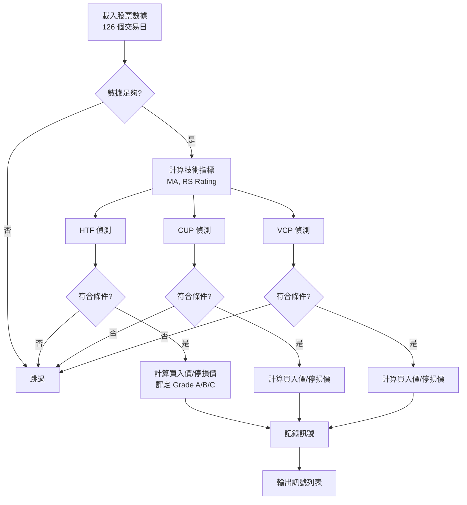

# 型態策略

本文件說明系統識別的三種技術型態：HTF、CUP、VCP 的定義、條件與邏輯。

## 型態總覽

| 型態 | 全名 | 特色 | 適用市況 |
|------|------|------|----------|
| **HTF** | High Tight Flag | 快速上漲後短暫整理 | 強勢股突破 |
| **CUP** | Cup with Handle | U 型底部加把手整理 | 穩健趨勢轉強 |
| **VCP** | Volatility Contraction Pattern | 波動遞減收斂 | 盤整末期爆發 |

## HTF (High Tight Flag)

### 定義

股價在短時間內快速上漲 (Pole)，隨後進入短暫橫向整理 (Flag)，成交量在整理期間萎縮，形成類似旗形的型態。

### 視覺化

```
Price
  │
  │      Flag
  │    ┌─────┐ ← Buy Point (Flag High)
  │    │     │
  │    │     │
  │   ─┘     └── ← Stop (Flag Low)
  │  /Pole
  │ /
  │/
  └────────────── Time
```

### 偵測條件

**統計窗口**: 最近 126 個交易日 (約 6 個月)

**Pole (上漲段) 條件**:
- 漲幅 ≥ 80% (min_up_ratio = 0.8)
- 從窗口起點到最高點

**Flag (整理段) 條件**:
- 長度: 3-12 個交易日 (min_flag_days=3, max_flag_days=12)
- 回檔幅度 ≤ 25% (max_pullback = 0.25)
- 成交量: Flag 期間平均量 < Pole 期間平均量

**額外過濾**:
- RS Rating ≥ 0 (相對強度為正)

### 買入價與停損價

- **買入價**: Flag 期間最高價 (flag_high)
- **停損價**: Flag 期間最低價 (flag_low)

**邏輯**: 等待價格突破 Flag 高點，表示整理結束繼續上攻；若跌破 Flag 低點則型態失效。

### Grade 評分系統

根據型態品質分級為 A/B/C:

| Grade | 條件 |
|-------|------|
| **A** | Pole 漲幅 > 90% **且** 回檔 < 15% **且** 成交量萎縮 > 50% |
| **B** | Pole 漲幅 > 90% **且** 回檔 15-20% |
| **C** | 回檔 20-25% (基本符合條件) |

**說明**:
- **A 級**: 強勢型態，上漲迅猛、整理淺、量縮明顯
- **B 級**: 優質型態，上漲夠強但整理稍深
- **C 級**: 合格型態，但品質一般

### 實作參考

詳細邏輯請參考 [src/strategies/htf.py](file:///Users/sony/ml_stock/stock/src/strategies/htf.py)。

---

## CUP (Cup with Handle)

### 定義

股價在數週至數月間形成圓弧狀底部 (Cup)，隨後在新高附近形成小幅整理 (Handle)，整體形態類似茶杯帶把手。

### 視覺化

```
Price
  │              Handle
  │             ┌──┐ ← Buy Point (Handle High)
  │            /    └─ ← Stop (Handle Low)
  │   Cup    /
  │   ╱────╲ 
  │  /      ╲
  │ /        ╲
  │/          ╲
  └──────────────── Time
```

### 偵測條件

**統計窗口**: 最近 126 個交易日 (約 6 個月)

**趨勢模板** (Minervini Trend Template):
- 當前價 > MA50 > MA150 > MA200
- 當前價 > 52 週低點 × 1.25
- MA200 上升趨勢

**Cup (杯身) 條件**:
- 深度: 12-33% (min_depth=0.12, max_depth=0.33)
- 形狀: 左側高點 → 中間低點 → 右側高點
- 位置: 底部在前 75% 窗口範圍內

**Handle (把手) 條件**:
- 長度: 最後 20% 窗口 (至少 5 個交易日)
- 深度: < 15% (handle_max_depth=0.15)
- 位置: 把手低點 > 杯底 + 0.5 × 杯深
- 成交量: Handle 平均量 < 整體平均量

**額外過濾**:
- RS Rating ≥ 0

### 買入價與停損價

- **買入價**: Handle 期間最高價 (handle_high)
- **停損價**: Handle 期間最低價 (handle_low)

**邏輯**: 等待突破 Handle 高點 (接近前高)，表示蓄勢完成準備突破；跌破 Handle 低點則型態失效。

### Grade 評分

CUP 型態目前不分 Grade，統一視為合格型態。

### 實作參考

詳細邏輯請參考 [src/strategies/cup.py](file:///Users/sony/ml_stock/stock/src/strategies/cup.py)。

---

## VCP (Volatility Contraction Pattern)

### 定義

股價在上漲趨勢中經歷多次整理，每次整理的波動幅度遞減，形成「收斂」態勢，伴隨成交量萎縮，最終突破爆發。

### 視覺化

```
Price
  │     Contraction 1  Contraction 2  Contraction 3
  │         ╱╲             ╱╲            ╱─ ← Buy Point
  │        /  ╲           /  ╲          /
  │       /    ╲─        /    ╲─       /
  │      /                              
  │     /        Volume Dry Up
  │    /
  │   /
  │  /
  └────────────────────────────────── Time
```

### 偵測條件

**統計窗口**: 最近 126 個交易日 (約 6 個月)

**趨勢條件**:
- 當前價 > MA50 (如果有)
- 窗口內漲幅 ≥ 50% (min_up_ratio = 0.5)
- RS Rating ≥ 0

**ZigZag Pivot 分析**:
- 使用 ZigZag 算法識別轉折點 (threshold = 7%)
- 至少需要 4 個 Pivot (形成至少 2 個收縮)
- Pivot 類型: Peak (高點) 和 Trough (低點)

**波動遞減條件**:
- 計算每對 Peak → Trough 的深度
- 最後一次收縮深度 < 第一次收縮深度 (基本遞減檢查)

**成交量萎縮條件**:
- 最近 5 日平均量 < MA50 量 × 45% (vol_dry_up_ratio = 0.45)

**突破條件**:
- 當前價接近最後一個 Peak (≥ 95%)

### 買入價與停損價

- **買入價**: 最後一個 Peak 價格 (last_high_price)
- **停損價**: 最後一個 Trough 價格 (last_low_price)

**邏輯**: 等待突破最後一個高點 Pivot，表示收斂結束開始爆發；跌破最後一個低點則型態失效。

### Grade 評分

VCP 型態目前不分 Grade，統一視為合格型態。

### 實作參考

詳細邏輯請參考 [src/strategies/vcp.py](file:///Users/sony/ml_stock/stock/src/strategies/vcp.py)。

---

## 型態偵測流程



## 訊號輸出格式

每個偵測到的型態會產生以下訊號資訊:

```python
{
    'date': '2025-11-23',           # 訊號日期
    'sid': '2330',                  # 股票代號
    'name': '台積電',                # 股票名稱
    'pattern': 'HTF',               # 型態類型 (HTF/CUP/VCP)
    'buy_price': 650.0,             # 買入價
    'stop_price': 620.0,            # 停損價
    'current_price': 640.0,         # 當前價
    'distance_pct': 1.54,           # 距離買入價百分比
    'status': '等待突破',            # 當前狀態 (等待突破/已突破)
    'grade': 'A',                   # Grade (HTF 有，CUP/VCP 為 N/A)
    'rs_rating': 85.2,              # RS Rating
    'risk_pct': 4.62               # 風險百分比 (買入價-停損價)/買入價
}
```

## 型態比較

| 特性 | HTF | CUP | VCP |
|------|-----|-----|-----|
| **時間長度** | 短 (3-12 天) | 中長 (數週至數月) | 中 (數週) |
| **進場時機** | 快速突破 | 穩健突破 | 收斂後爆發 |
| **風險報酬** | 高風險高報酬 | 中風險中報酬 | 中風險高報酬 |
| **適合資金** | 小額靈活 | 大額布局 | 中等|
| **Grade 系統** | 有 (A/B/C) | 無 | 無 |
| **成功率** | 中等 (需配合 ML) | 高 | 中高 |

## 相關文件

- [基礎策略系統](file:///Users/sony/ml_stock/stock/docs/04_基礎策略系統.md) - 型態偵測的執行流程
- [ML Enhanced 系統](file:///Users/sony/ml_stock/stock/docs/05_ML_Enhanced系統.md) - 使用 ML 過濾型態訊號
- [CatBoost Enhanced 系統](file:///Users/sony/ml_stock/stock/docs/06_CatBoost_Enhanced系統.md) - 使用 CatBoost 評級訊號品質
