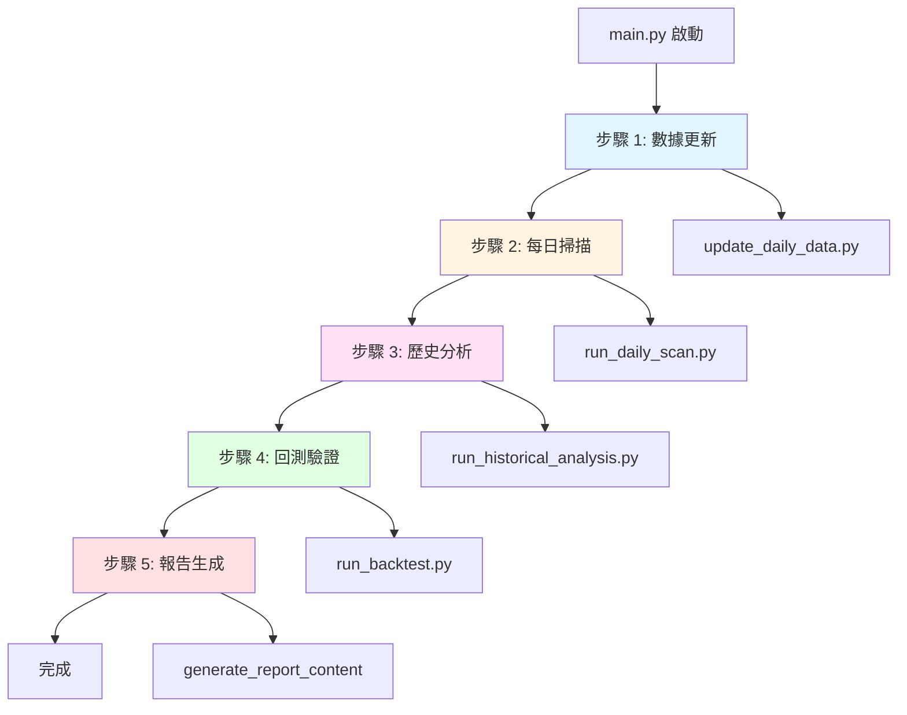

# 基礎策略系統

本文件說明原始策略掃描系統 (`main.py`) 的執行流程與核心邏輯。

## 系統概述

基礎策略系統是整個交易系統的第一層，負責：
- 每日數據更新 (TWSE + TPEX 約 1900 檔)
- 技術型態識別 (HTF/CUP/VCP)
- 歷史分析與回測驗證
- 生成基礎訊號報告

**執行時間**: 每日 19:00 (Crontab 自動執行)

**輸出位置**: `daily_tracking_stock/YYYY-MM-DD/daily_summary.md`

## 執行流程



## 步驟 1: 數據更新

**腳本**: `scripts/update_daily_data.py`

### 執行內容

1. **爬取股價數據**
   - 使用 yfinance 下載 TWSE (上市) 和 TPEX (上櫃) 股票
   - 約 1900 檔，每檔下載最近數年數據
   - 儲存至 `data/raw/daily_quotes/`

2. **計算技術指標**
   - MA20, MA50, MA150, MA200 (移動平均線)
   - Volume MA50 (成交量移動平均)
   - 52 週高低點

3. **計算 RS Rating**
   - 相對強度評分 (0-100)
   - 比較該股票與市場整體表現

4. **合併儲存**
   - 整合所有股票數據為單一 CSV
   - 儲存至 `data/processed/master_data.csv`

### 關鍵邏輯

**RS Rating 計算**: 
- 比較股票與市場的 N 日報酬率
- 使用百分位數排名 (0-100)
- 高RS表示跑贏大盤，低RS表示跑輸

**數據品質控制**:
- 過濾成交量過低的股票
- 移除停牌或異常數據
- 確保數據連續性

---

## 步驟 2: 每日掃描

**腳本**: `scripts/run_daily_scan.py`

### 執行內容

1. **載入最新數據**
   - 讀取 `data/processed/master_data.csv`
   - 取得最新交易日的所有股票

2. **型態偵測**
   - 對每檔股票使用 126 天窗口
   - 依序檢查 HTF、CUP、VCP 型態
   - 詳細邏輯參考 [型態策略文件](file:///Users/sony/ml_stock/stock/docs/03_型態策略.md)

3. **訊號生成**
   - 記錄符合條件的股票
   - 計算買入價、停損價
   - HTF 計算 Grade (A/B/C)
   - 計算當前價距離買入價的百分比

4. **輸出訊號列表**
   - CSV: `data/processed/latest_signals.csv`
   - Markdown: `data/processed/latest_signals_report.md`

### 核心邏輯

**多型態偵測**:
- 同一股票可能符合多種型態
- 各型態獨立計算買入價/停損價
- 最終報告分別列示

**狀態判斷**:
- **等待突破**: 當前價 < 買入價
- **已突破**: 當前價 ≥ 買入價
- **型態失效**: 當前價 < 停損價 (不列入報告)

---

## 步驟 3: 歷史分析

**腳本**: `scripts/run_historical_analysis.py`

### 執行內容

1. **回溯型態識別**
   - 對歷史每個交易日執行型態掃描
   - 建立完整的歷史訊號資料庫

2. **標註訊號結果**
   - 追蹤每個訊號後續表現
   - 記錄是否成功突破、持有時間、報酬率

3. **儲存訓練數據**
   - 輸出: `data/processed/pattern_analysis_result.csv`
   - 用於 ML 模型訓練

### 關鍵邏輯

**數據窗口**: 通常分析最近 1-2 年歷史數據

**訊號標註**:
- 成功: 突破後漲幅達到目標 (如 2R)
- 失敗: 觸及停損或時間出場未獲利
- 用於訓練 ML 模型的標籤

---

## 步驟 4: 回測驗證

**腳本**: `scripts/run_backtest.py`

### 執行內容

1. **載入歷史訊號**
   - 讀取 `pattern_analysis_result.csv`

2. **模擬交易**
   - 資金管理: 初始 100 萬，每筆 10%，最多 10 檔
   - 進場邏輯: 訊號後 30 天內突破買入價
   - 出場邏輯: Fixed R-multiple 或 Trailing Stop
   - 支援 Pyramiding (同股多次進場)

3. **計算績效**
   - 年化報酬率、Sharpe Ratio、勝率
   - 最大回撤、平均持倉天數
   - 按策略組合分組統計

4. **輸出結果**
   - `data/processed/backtest_results_v2.csv`

### 關鍵邏輯

詳細回測邏輯請參考 [回測引擎文件](file:///Users/sony/ml_stock/stock/docs/07_回測引擎.md)。

---

## 步驟 5: 報告生成

**函數**: `generate_report_content()` (in main.py)

### 報告內容

**章節 1: 本日掃描結果**
- 顯示今日偵測到的所有型態訊號
- 按 HTF、CUP、VCP 分組
- 顯示買入價、停損價、距離%、狀態

**章節 2: 過去一週訊號彙整**
- 從 `pattern_analysis_result.csv` 提取最近 7 天訊號
- 過濾仍然有效的型態 (未跌破停損)
- 更新當前價與距離%

**章節 3: Top 3 策略績效**
- 從回測結果選出最佳策略
- 按年化報酬、Sharpe 分別排序
- 顯示詳細績效指標

### 報告儲存

**目錄結構**:
```
daily_tracking_stock/YYYY-MM-DD/
├── daily_summary.md           # 主報告
├── latest_signals.csv         # 訊號列表
└── backtest_results_v2.csv    # 回測結果
```

**報告格式**: GitHub-flavored Markdown，包含表格與統計資訊

---

## 相關文件

- [型態策略](file:///Users/sony/ml_stock/stock/docs/03_型態策略.md) - HTF/CUP/VCP 偵測邏輯
- [回測引擎](file:///Users/sony/ml_stock/stock/docs/07_回測引擎.md) - 回測邏輯與資金管理
- [數據管道](file:///Users/sony/ml_stock/stock/docs/08_數據管道.md) - 數據來源與處理
- [自動化排程](file:///Users/sony/ml_stock/stock/docs/02_自動化排程.md) - Crontab 設定與時程

## 實作參考

- 主入口: [main.py](file:///Users/sony/ml_stock/stock/main.py)
- 數據更新: [scripts/update_daily_data.py](file:///Users/sony/ml_stock/stock/scripts/update_daily_data.py)
- 每日掃描: [scripts/run_daily_scan.py](file:///Users/sony/ml_stock/stock/scripts/run_daily_scan.py)
- 歷史分析: [scripts/run_historical_analysis.py](file:///Users/sony/ml_stock/stock/scripts/run_historical_analysis.py)
- 回測引擎: [scripts/run_backtest.py](file:///Users/sony/ml_stock/stock/scripts/run_backtest.py)
