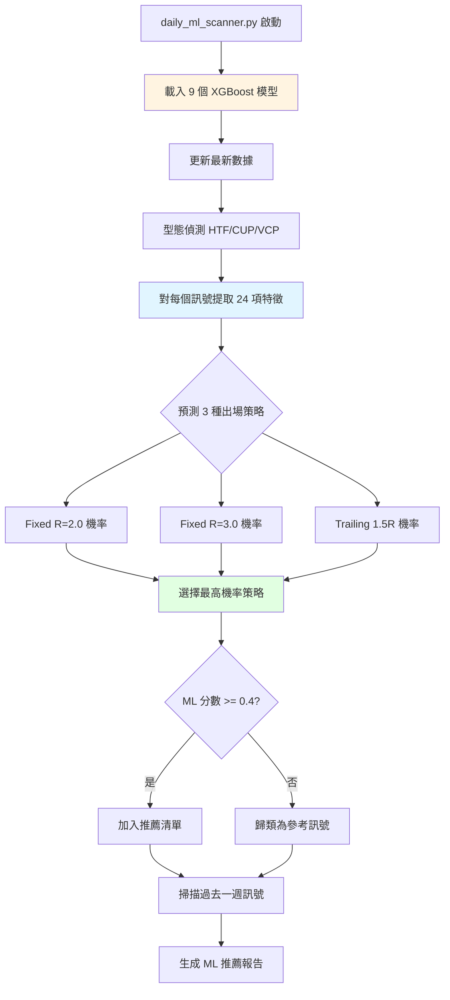
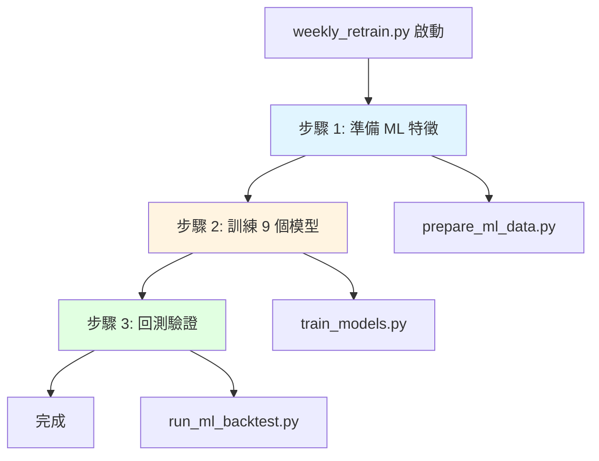

# ML Enhanced 系統

本文件說明 ML Enhanced 系統的運作邏輯，包含每日掃描和每週重訓流程。

## 系統概述

ML Enhanced 系統基於 **9 個獨立 XGBoost 模型**，為基礎策略偵測到的型態訊號提供智能過濾與出場策略推薦。

**核心特色**:
- 9 個模型 = 3 patterns (HTF/CUP/VCP) × 3 exit_modes (Fixed R=2.0/R=3.0/Trailing 1.5R)
- 各組合獨立優化
- ML 分數 ≥ 0.4 視為高品質訊號
- 智能推薦最佳出場策略

**執行時間**:
- 每日掃描: 19:05
- 每週重訓: 週日 02:00

**輸出位置**: `ml_enhanced/daily_reports/YYYY-MM-DD/`

## 每日掃描流程

**腳本**: `ml_enhanced/daily_ml_scanner.py`

### 步驟 1: 載入模型與特徵

**模型載入** (`load_all_ml_models`):
- 載入 9 個 `.pkl` 模型檔案
- 模型位置: `ml_enhanced/models/stock_selector_{pattern}_{exit}.pkl`
- 特徵信息: `ml_enhanced/models/feature_info.pkl`

**特徵列表** (24 項):
| 類別 | 特徵 |
|------|------|
| 型態品質 | buy_price_pct, stop_price_pct, risk_pct |
| 成交量 | volume_ratio, volume_trend, volume_ma_ratio |
| 動能指標 | price_change_5d, price_change_20d, momentum |
| RSI | rsi_14, rsi_divergence |
| 趨勢 | ema_alignment, trend_strength |
| 波動 | volatility_20d, atr_percent |
| 市場環境 | near_52w_high, above_ma50 |
| RS | rs_rating, rs_trend |
| 型態專屬 | htf_grade_encoded, cup_depth, vcp_contractions 等 |
| 訊號密度 | pattern_count_30d |

### 步驟 2: 型態偵測與特徵提取

**型態偵測**:
- 複用基礎策略層的偵測函數 (`detect_htf`, `detect_cup`, `detect_vcp`)
- 對每檔股票使用 126 天窗口

**特徵工程** (`extract_ml_features`):
- 從原始數據計算 24 項特徵
- 處理缺失值 (填 0)
- 標準化數值範圍

### 步驟 3: ML 預測與智能出場

**預測流程** (`predict_best_exit`):
1. 對同一訊號使用 3 個模型預測 (pattern 相同，exit 不同)
2. 每個模型輸出成功機率 (0-1)
3. 選擇機率最高的出場策略

**輸出**:
- `best_exit`: 推薦策略名稱 ('fixed_r2_t20' / 'fixed_r3_t20' / 'trailing_15r')
- `best_ml_score`: 該策略的 ML 分數
- `all_predictions`: 三種策略的分數 (供參考)

### 步驟 4: 過濾與分類

**高品質訊號** (ML ≥ 0.4):
- 優先推薦
- 顯示推薦出場策略 ⭐
- 顯示所有 3 種策略分數供對比

**參考訊號** (ML < 0.4):
- 僅供參考
- 品質較低，建議謹慎

### 步驟 5: 過去一週訊號

**掃描邏輯** (`scan_past_week`):
- 從歷史數據提取最近 7 天的訊號
- 重新計算 ML 分數
- 只顯示 ML ≥ 0.4 的高品質歷史訊號

### 步驟 6: 報告生成

**報告內容** (`generate_ml_report`):

**章節 1: 本日訊號統計**
- 總訊號數、ML 推薦數、原始訊號數

**章節 2: ML 推薦訊號** (ML ≥ 0.4)
- 按 HTF/CUP/VCP 分組
- 顯示推薦出場策略 (標註 ⭐)
- 顯示其他選項的 ML 分數

**章節 3: 其他原始訊號** (ML < 0.4)
- 僅供參考的低品質訊號

**章節 4: 過去一週訊號彙整** (ML ≥ 0.4)
- 近 7 天的高品質歷史訊號

**章節 5: Top 3 Strategies**
- 從回測結果動態讀取
- 按年化報酬、Sharpe 排序

**章節 6: 交易策略說明**
- 從回測結果提取最佳策略的績效預期

**章節 7: ML 分數解讀**
- ≥ 0.5: Elite (頂級)
- 0.4-0.5: Strong (強力)
- 0.3-0.4: Moderate (普通)

**輸出檔案**:
- `ml_enhanced/daily_reports/YYYY-MM-DD/ml_daily_summary.md`
- `ml_enhanced/daily_reports/YYYY-MM-DD/ml_signals.csv`

---

## 每週重訓流程

**腳本**: `ml_enhanced/weekly_retrain.py`

### 步驟 1: 準備 ML 特徵

**腳本**: `ml_enhanced/scripts/prepare_ml_data.py`

**執行內容**:
1. 載入歷史訊號數據 (`pattern_analysis_result.csv`)
2. 對每個訊號提取 24 項特徵
3. 為 3 種出場方式分別標註成功/失敗標籤
4. 生成 3 份訓練數據集 (pattern × exit)

**輸出**:
- `ml_enhanced/data/training_data_{pattern}_{exit}.csv` (9 個檔案)

**標籤定義**:
- **Fixed R=2.0**: 突破後漲幅 ≥ 2R 為成功
- **Fixed R=3.0**: 突破後漲幅 ≥ 3R 為成功
- **Trailing 1.5R**: 使用 Trailing Stop 出場獲利為成功

### 步驟 2: 訓練 9 個模型

**腳本**: `ml_enhanced/scripts/train_models.py`

**執行內容**:
1. 載入 9 份訓練數據
2. 分割訓練集/測試集 (80/20)
3. 訓練 9 個獨立 XGBoost 模型
4. 評估模型性能 (ROC AUC, 準確率)
5. 保存模型權重

**模型參數** (XGBoost):
- max_depth: 3-5
- learning_rate: 0.01-0.1
- n_estimators: 100-500
- scale_pos_weight: 自動平衡正負樣本

**輸出**:
- `ml_enhanced/models/stock_selector_{pattern}_{exit}.pkl` (9 個)
- `ml_enhanced/models/feature_info.pkl`

### 步驟 3: 回測驗證

**腳本**: `ml_enhanced/scripts/run_ml_backtest.py`

**執行內容**:
1. 使用新模型對歷史訊號評分
2. 模擬交易 (資金管理、進出場規則)
3. 計算績效指標
4. 生成回測報告

**輸出**:
- `ml_enhanced/results/ml_backtest_final.csv`
- `ml_enhanced/results/ml_backtest_final.md`

---

## 9 模型架構

| Pattern | Exit Mode | 模型名稱 | 目標 |
|---------|-----------|----------|------|
| HTF | Fixed R=2.0 | stock_selector_htf_fixed_r2_t20.pkl | 預測 HTF 型態使用 R=2.0 的成功率 |
| HTF | Fixed R=3.0 | stock_selector_htf_fixed_r3_t20.pkl | 預測 HTF 型態使用 R=3.0 的成功率 |
| HTF | Trailing 1.5R | stock_selector_htf_trailing_15r.pkl | 預測 HTF 型態使用 Trailing 的成功率 |
| CUP | Fixed R=2.0 | stock_selector_cup_fixed_r2_t20.pkl | 預測 CUP 型態使用 R=2.0 的成功率 |
| CUP | Fixed R=3.0 | stock_selector_cup_fixed_r3_t20.pkl | 預測 CUP 型態使用 R=3.0 的成功率 |
| CUP | Trailing 1.5R | stock_selector_cup_trailing_15r.pkl | 預測 CUP 型態使用 Trailing 的成功率 |
| VCP | Fixed R=2.0 | stock_selector_vcp_fixed_r2_t20.pkl | 預測 VCP 型態使用 R=2.0 的成功率 |
| VCP | Fixed R=3.0 | stock_selector_vcp_fixed_r3_t20.pkl | 預測 VCP 型態使用 R=3.0 的成功率 |
| VCP | Trailing 1.5R | stock_selector_vcp_trailing_15r.pkl | 預測 VCP 型態使用 Trailing 的成功率 |

**設計理念**: 每個組合獨立優化，捕捉不同 pattern-exit 的細微差異。

---

## 系統優勢

**相比基礎策略**:
- 過濾低品質訊號，提升勝率 (60-75%)
- 智能推薦出場策略，最大化每個訊號潛力
- ROC AUC 0.55-0.63，有效區分高低品質訊號

**相比單一模型**:
- 9 個模型各司其職，無需妥協
- 可針對不同風險偏好選擇出場策略
- 提供多種選項的透明度 (顯示所有 3 種策略分數)

---

## 相關文件

- [系統架構](file:///Users/sony/ml_stock/stock/docs/01_系統架構.md) - ML Enhanced 在三層架構中的位置
- [型態策略](file:///Users/sony/ml_stock/stock/docs/03_型態策略.md) - 型態偵測基礎
- [回測引擎](file:///Users/sony/ml_stock/stock/docs/07_回測引擎.md) - 出場策略邏輯
- [自動化排程](file:///Users/sony/ml_stock/stock/docs/02_自動化排程.md) - 執行時程

## 技術細節

更多 ML 模型訓練細節、特徵重要性分析請參考:
- **[ML Enhanced 技術文件](file:///Users/sony/ml_stock/stock/ml_enhanced/ML_SYSTEM.md)**

## 實作參考

- 每日掃描: [ml_enhanced/daily_ml_scanner.py](file:///Users/sony/ml_stock/stock/ml_enhanced/daily_ml_scanner.py)
- 每週重訓: [ml_enhanced/weekly_retrain.py](file:///Users/sony/ml_stock/stock/ml_enhanced/weekly_retrain.py)
- 特徵準備: [ml_enhanced/scripts/prepare_ml_data.py](file:///Users/sony/ml_stock/stock/ml_enhanced/scripts/prepare_ml_data.py)
- 模型訓練: [ml_enhanced/scripts/train_models.py](file:///Users/sony/ml_stock/stock/ml_enhanced/scripts/train_models.py)
- ML 回測: [ml_enhanced/scripts/run_ml_backtest.py](file:///Users/sony/ml_stock/stock/ml_enhanced/scripts/run_ml_backtest.py)
