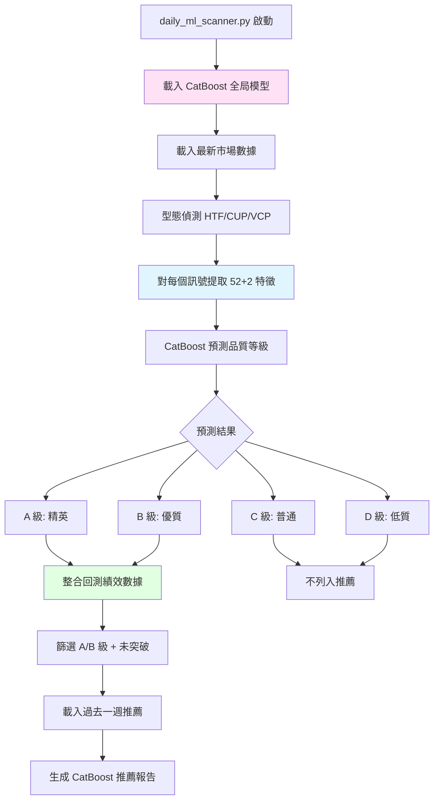
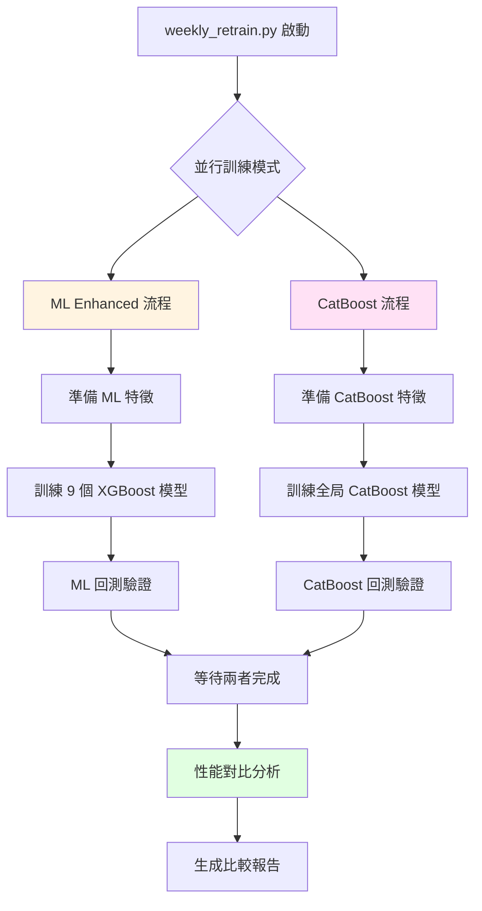

# CatBoost Enhanced 系統

本文件說明 CatBoost Enhanced 系統的運作邏輯，包含每日掃描和每週重訓流程。

## 系統概述

CatBoost Enhanced 系統基於 **1 個全局 CatBoost 多分類模型**，將訊號品質分級為 A/B/C/D 四個等級，並整合歷史回測績效提供決策依據。

**核心特色**:
- 全局模型學習跨組合規律
- pattern_type 和 exit_mode 作為分類特徵
- P0-P2 進階訓練技術 (Embargo + 樣本權重)
- 品質分級 + 績效預期整合

**執行時間**:
- 每日掃描: 19:10
- 每週重訓: 週日 02:00 (與 ML Enhanced 並行)

**輸出位置**: `catboost_enhanced/results/`

## 與 ML Enhanced 的差異

| 特性 | ML Enhanced | CatBoost Enhanced |
|------|-------------|-------------------|
| **模型數量** | 9 個獨立模型 | 1 個全局模型 |
| **模型類型** | XGBoost 二分類 | CatBoost 多分類 (4 classes) |
| **特徵數** | 24 項 | 52 數值 + 2 分類 |
| **輸出** | 成功機率 (0-1) | 品質等級 (A/B/C/D) |
| **出場策略** | 智能推薦最佳策略 | 整合各組合歷史績效 |
| **訓練技術** | 基礎訓練 | P0 基礎 + P1 Embargo + P2 樣本權重 |
| **優勢** | 各組合極致優化 | 捕捉跨組合規律，避免過擬合 |

**互補性**: 兩者提供不同視角，可交叉驗證訊號品質。

---

## 每日掃描流程

**腳本**: `catboost_enhanced/daily_ml_scanner.py`

### 步驟 1: 載入模型與數據

**模型載入** (`load_model_and_features`):
- CatBoost 模型: `catboost_enhanced/models/catboost_global.cbm`
- 特徵信息: `catboost_enhanced/models/catboost_feature_info.pkl`

**數據載入** (`get_today_signals`):
- 使用 Polars 載入最新市場數據
- 保留最新交易日的所有記錄
- 提取有型態訊號的股票 (is_htf/is_cup/is_vcp = True)

### 步驟 2: 特徵準備

**特徵工程** (`prepare_features_for_model`):

**數值特徵** (52 項):
- 價格相關: close, open, high, low, volume
- 技術指標: MA20/50/150/200, RSI, ATR, Bollinger Bands
- 動能: ROC, Momentum, MACD
- 成交量: Volume MA, Volume Ratio
- 趨勢: EMA Alignment, ADX
- 波動: Volatility, ATR %
- RS Rating 與趨勢
- 機構流特徵: 外資/投信/自營買賣超, Net Flow

**分類特徵** (2 項):
- `pattern_type`: 'htf' / 'cup' / 'vcp'
- `exit_mode`: 'fixed_r2_t20' / 'fixed_r3_t20' / 'trailing_15r'

**關鍵**: pattern 和 exit_mode 作為特徵，讓模型學習哪些組合表現更好。

### 步驟 3: 品質預測

**預測邏輯** (`predict_signal_quality`):
- CatBoost 輸出 4 個類別的機率
- 取機率最高的類別作為預測等級

**品質等級定義**:
- **A 級 (3)**: 精英訊號，歷史勝率 > 75%，報酬 > 20%
- **B 級 (2)**: 優質訊號，歷史勝率 > 65%，報酬 > 15%
- **C 級 (1)**: 普通訊號，歷史勝率 > 55%，報酬 > 10%
- **D 級 (0)**: 低質訊號，勝率或報酬低於標準

### 步驟 4: 整合回測績效

**績效匹配** (`enrich_with_backtest_performance`):
- 從 `catboost_enhanced/results/backtest_by_group.csv` 載入歷史績效
- 根據 pattern_type 和 exit_mode 匹配
- 為每個推薦訊號附加:
  - 年化報酬 (Ann. Return %)
  - 勝率 (Win Rate)
  - Sharpe Ratio
  - 最大回撤 (Max Drawdown %)
  - 連勝/連敗次數

**意義**: 讓使用者知道該組合的歷史平均表現，輔助決策。

### 步驟 5: 推薦清單生成

**篩選條件**:
- 品質等級: A 或 B
- 當前狀態: 等待突破 (current_price < buy_price)
- 未失效: current_price > stop_price

**報告內容** (`generate_recommendation_report`):

**章節 1: 本日訊號統計**
- 總訊號數 (所有 A/B/C/D)

**章節 2: 本日推薦清單** (A/B 級、未突破)
- 按 A/B 級別分組
- 顯示: 代碼、Pattern、出場模式、當前價、買入價、停損價、距離%、狀態
- 附加: 年化報酬、勝率、Sharpe、MDD、連勝/連敗

**章節 3: 過去一週推薦清單** (未突破)
- 載入過去 7 天的推薦訊號 (`load_weekly_signals`)
- 篩選還沒突破的 A/B 級訊號
- 按日期分組顯示

**章節 4: Top 3 Strategies**
- 從回測結果提取最佳 3 個組合
- 按年化報酬、Sharpe 排序
- 顯示詳細績效

**輸出檔案**:
- `catboost_enhanced/results/catboost_daily_summary_YYYY-MM-DD.md`
- `catboost_enhanced/results/daily_scan_YYYY-MM-DD.csv`

---

## 每週重訓流程

**腳本**: `catboost_enhanced/weekly_retrain.py`

### 並行訓練設計

**意義**: 同時訓練兩套模型，節省時間並便於對比。

**實作**: 使用 `ProcessPoolExecutor` 並行執行訓練任務。

### CatBoost 訓練流程

**步驟 1: 準備 CatBoost 特徵**

**腳本**: `catboost_enhanced/scripts/prepare_catboost_data.py`

- 載入歷史訊號
- 提取 52 項數值特徵 + 2 項分類特徵
- 標註品質等級 (A/B/C/D)
- 輸出: `catboost_enhanced/data/training_data.csv`

**步驟 2: 訓練全局模型**

**腳本**: `catboost_enhanced/scripts/train.py`

**P0 基礎訓練**:
- 使用全部訓練數據
- CatBoost 多分類 (4 classes)

**P1 Embargo 技術**:
- 在訊號日期附近設置隔離區 (±N 天)
- 避免數據洩漏 (未來數據影響過去預測)

**P2 樣本權重**:
- Score 幅度權重: 報酬越高權重越大
- 標籤等級權重: A 級權重 > B 級 > C/D 級
- 類頻率補償: 平衡各等級樣本數

**模型參數** (CatBoost):
- iterations: 500-1000
- depth: 4-6
- learning_rate: 0.03-0.1
- l2_leaf_reg: 3-5

**輸出**:
- `catboost_enhanced/models/catboost_global.cbm`
- `catboost_enhanced/models/catboost_feature_info.pkl`

**步驟 3: 回測驗證**

**腳本**: `catboost_enhanced/scripts/run_catboost_backtest.py`

- 使用新模型預測歷史訊號品質
- 只交易 A/B 級訊號
- 按 pattern × exit_mode 分組統計績效
- 輸出: `catboost_enhanced/results/backtest_by_group.csv`

### 性能對比分析

**比較維度** (`compare_models`):
- ML Enhanced: 總交易數、平均報酬、勝率
- CatBoost Enhanced: 組合數、年化報酬、勝率、最佳組合

**對比報告** (`generate_report`):
- 執行摘要: 兩套系統的架構與訓練方法
- 性能統計: 各自的績效指標
- 關鍵發現: 差異分析與後續建議
- 輸出: `catboost_enhanced/results/weekly_comparison_report.md`

---

## P0-P2 訓練技術

### P0: 基礎訓練
- 標準 CatBoost 多分類訓練
- 無特殊技術

### P1: Embargo 隔離
**問題**: 時間序列數據存在數據洩漏風險

**解決**: 在訓練/驗證分割時，在訊號日期附近設置隔離區 (如 ±7 天)，確保驗證集訊號的未來數據不會出現在訓練集。

### P2: 三層樣本權重

**1. Score 幅度權重**:
- 根據訊號的實際報酬率調整權重
- 高報酬訊號權重更大，讓模型學習識別大贏家

**2. 標籤等級權重**:
- A 級: 權重 × 2.0
- B 級: 權重 × 1.5
- C/D 級: 權重 × 1.0

**3. 類頻率補償**:
- 自動平衡各等級的樣本數
- 避免模型偏向多數類別

**意義**: 讓模型不僅學習分類，還學習重視高品質、高報酬的訊號。

---

## 相關文件

- [系統架構](file:///Users/sony/ml_stock/stock/docs/01_系統架構.md) - CatBoost 在三層架構中的位置
- [ML Enhanced 系統](file:///Users/sony/ml_stock/stock/docs/05_ML_Enhanced系統.md) - 對比 9 模型與全局模型
- [型態策略](file:///Users/sony/ml_stock/stock/docs/03_型態策略.md) - 型態偵測基礎
- [回測引擎](file:///Users/sony/ml_stock/stock/docs/07_回測引擎.md) - 績效驗證邏輯

## 技術細節

更多 CatBoost 模型訓練細節、P0-P2 技術原理請參考:
- **[CatBoost Enhanced 技術文件](file:///Users/sony/ml_stock/stock/catboost_enhanced/CATBOOST_SYSTEM.md)**

## 實作參考

- 每日掃描: [catboost_enhanced/daily_ml_scanner.py](file:///Users/sony/ml_stock/stock/catboost_enhanced/daily_ml_scanner.py)
- 每週重訓: [catboost_enhanced/weekly_retrain.py](file:///Users/sony/ml_stock/stock/catboost_enhanced/weekly_retrain.py)
- 特徵準備: [catboost_enhanced/scripts/prepare_catboost_data.py](file:///Users/sony/ml_stock/stock/catboost_enhanced/scripts/prepare_catboost_data.py)
- 模型訓練: [catboost_enhanced/scripts/train.py](file:///Users/sony/ml_stock/stock/catboost_enhanced/scripts/train.py)
- 回測驗證: [catboost_enhanced/scripts/run_catboost_backtest.py](file:///Users/sony/ml_stock/stock/catboost_enhanced/scripts/run_catboost_backtest.py)
