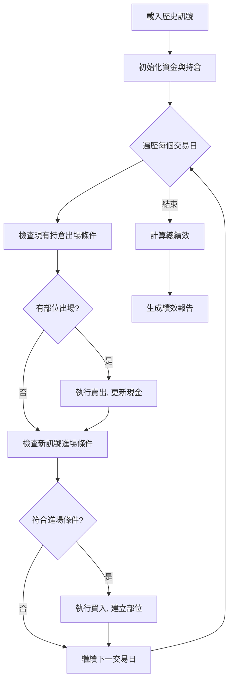

# 回測引擎

本文件說明系統的回測邏輯、資金管理規則與績效驗證方法。

## 回測引擎概述

回測引擎模擬真實交易環境，驗證策略在歷史數據上的表現。系統使用 **V2 回測引擎**，支援複雜的資金管理與 Pyramiding 邏輯。

**核心文件**: `scripts/backtest_engine_v2.py`

**使用場景**:
- 基礎策略系統回測
- ML Enhanced 系統回測
- CatBoost Enhanced 系統回測

## 回測模式

sistem支援三種回測模式：

### 1. 基礎策略回測
- 測試原始型態訊號 (HTF/CUP/VCP)
- 不使用 ML 過濾
-使用固定出場策略

### 2. ML Enhanced 回測
- 使用 ML 分數過濾 (threshold 0.4/0.5)
- 為每個訊號使用推薦的出場策略
- 測試 9 個模型的組合效果

### 3. CatBoost Enhanced 回測
- 只交易 A/B 級訊號
- 按 pattern × exit_mode 分組統計
- 測試全局模型的分級效果

---

## 資金管理規則

### 初始設定

| 參數 | 數值 | 說明 |
|------|------|------|
| 初始資金 | 100 萬 | 起始本金 |
| 倉位大小 | 總資產 × 10% | 每筆交易佔比 |
| 最大持倉 | 10 檔 | 同時持有股數上限 |
| 複利計算 | 是 | 基於當前總資產計算倉位 |

### 進場規則

**追蹤窗口**: 訊號產生後 30 天

**進場條件**:
1. **突破買入價**: close ≥ buy_price
2. **現金足夠**: 可用現金 ≥ 倉位金額
3. **持倉未滿**: 當前持倉 < 10 檔
4. **未過期**: 距離訊號日 ≤ 30 天

**Pyramiding 邏輯**:
- 允許同一股票多次進場
- 前提: 符合進場條件且持倉未滿
- 意義: 捕捉超級強勢股的多波段漲幅

### 出場規則

系統支援 3 種出場策略:

#### 1. Fixed R=2.0 (固定 2R 停利)

**出場條件** (任一觸發):
- **停利**: close ≥ entry_price + 2 × risk (risk = entry_price - stop_price)
- **停損**: close < stop_price
- **時間**: 持有 20 個交易日

**特色**: 保守穩健，及早獲利了結

#### 2. Fixed R=3.0 (固定 3R 停利)

**出場條件** (任一觸發):
- **停利**: close ≥ entry_price + 3 × risk
- **停損**: close < stop_price
- **時間**: 持有 20 個交易日

**特色**: 追求更高報酬，適合強勢股

#### 3. Trailing 1.5R (移動停利)

**初始停損**: stop_price

**移動邏輯**:
- 當 close ≥ entry_price + 1.5 × risk 時啟動
- 停損線上移至 entry_price (保本)
- 之後持續追蹤最高價，停損線 = highest_price - 1.5 × risk

**出場條件**:
- close < 移動停損線
- 時間: 持有 20 個交易日

**特色**: 讓利潤奔跑，適合趨勢延伸的股票

---

## 回測流程



### 詳細步驟

**1. 載入數據**:
- 歷史訊號列表 (每個訊號包含: sid, date, pattern, buy_price, stop_price, exit_mode)
- 股價數據 (每日 OHLCV)

**2. 初始化**:
- 現金 = 100 萬
- 持倉列表 = []
- 交易記錄 = []

**3. 主循環 (每個交易日)**:

**3.1 檢查出場**:
- 遍歷所有持倉
- 根據 exit_mode 檢查出場條件
- 若觸發, 執行賣出:
  - 賣出價 = 當日收盤價
  - 釋放現金 = shares × sell_price
  - 記錄交易 (entry_price, exit_price, return_pct, holding_days)
  - 移除持倉

**3.2 檢查進場**:
- 遍歷當日所有訊號 (date = 當日 且 距離訊號日 ≤ 30 天)
- 若符合進場條件:
  - 計算倉位金額 = 總資產 × 10%
  - 計算股數 = 倉位金額 / buy_price
  - 扣除現金
  - 建立持倉記錄 (entry_price, stop_price, exit_mode, entry_date)

**4. 最終結算**:
- 強制平倉所有剩餘持倉 (以最後交易日收盤價)
- 計算最終總資產 = 現金 + 所有持倉市值

**5. 績效計算**:
- 年化報酬率
- Sharpe Ratio
- 勝率
- 最大回撤
- 平均持倉天數
- 最大連勝/連敗

---

## 績效指標

### 年化報酬 (Ann. Return %)

**公式**:
```
Ann. Return % = ((最終資產 / 初始資產) ^ (365 / 總天數) - 1) × 100
```

**意義**: 平均每年的報酬率

### Sharpe Ratio

**公式**:
```
Sharpe = (年化報酬 - 無風險利率) / 年化波動率
```

**意義**: 風險調整後報酬，數值越高越好
- \> 2.0: 優秀
- 1.0-2.0: 良好
- < 1.0: 一般

### 勝率 (Win Rate)

**公式**:
```
Win Rate = (獲利交易數 / 總交易數) × 100
```

**意義**: 成功交易的比例

### 最大回撤 (Max Drawdown %)

**定義**: 資產淨值從最高點到最低點的最大跌幅

**公式**:
```
Max DD % = ((谷底資產 - 峰頂資產) / 峰頂資產) × 100
```

**意義**: 最壞情況下的損失幅度

### 平均持倉天數 (Avg Holding Days)

**計算**: 所有交易的持倉天數平均值

**意義**: 策略的週轉率指標

### 連勝/連敗 (Max Win/Loss Streak)

**定義**: 最長的連續獲利/虧損交易次數

**意義**: 策略穩定性與心理壓力指標

---

## 回測驗證要點

### 避免 Look-Ahead Bias (前視偏差)

**問題**: 使用未來數據預測過去

**解決**:
- 訊號產生日 < 進場日 < 出場日 (嚴格時間順序)
- ML 模型訓練數據不包含測試期間
- 技術指標只使用歷史數據計算

### 避免 Survivorship Bias (倖存者偏差)

**問題**: 只測試未下市股票

**解決**:
- 包含歷史期間所有股票 (即使後來下市)
- 數據來源涵蓋完整市場 (TWSE + TPEX)

### 交易成本考量

**系統簡化假設**:
- 不考慮手續費與交易稅 (約 0.3-0.4%)
- 不考慮滑價 (使用收盤價成交)
- T+0 假設 (當日可動用賣出資金)

**注意**: 實際報酬會略低於回測結果。

---

## 回測報告輸出

###基礎策略回測
- `data/processed/backtest_results_v2.csv`
- 按 pattern × exit_mode 分組

### ML Enhanced 回測
- `ml_enhanced/results/ml_backtest_final.csv`
- 按 pattern × exit_mode × ml_threshold 分組

### CatBoost Enhanced 回測
- `catboost_enhanced/results/backtest_by_group.csv`
- 按 pattern × exit_mode 分組 (只含 A/B 級訊號)

---

## 相關文件

- [基礎策略系統](file:///Users/sony/ml_stock/stock/docs/04_基礎策略系統.md) - 基礎回測流程
- [ML Enhanced 系統](file:///Users/sony/ml_stock/stock/docs/05_ML_Enhanced系統.md) - ML 回測邏輯
- [CatBoost Enhanced 系統](file:///Users/sony/ml_stock/stock/docs/06_CatBoost_Enhanced系統.md) - CatBoost 回測邏輯

## 實作參考

- V2 回測引擎: [scripts/backtest_engine_v2.py](file:///Users/sony/ml_stock/stock/scripts/backtest_engine_v2.py)
- 基礎回測: [scripts/run_backtest.py](file:///Users/sony/ml_stock/stock/scripts/run_backtest.py)
- ML 回測: [ml_enhanced/scripts/run_ml_backtest.py](file:///Users/sony/ml_stock/stock/ml_enhanced/scripts/run_ml_backtest.py)
- CatBoost 回測: [catboost_enhanced/scripts/run_catboost_backtest.py](file:///Users/sony/ml_stock/stock/catboost_enhanced/scripts/run_catboost_backtest.py)
