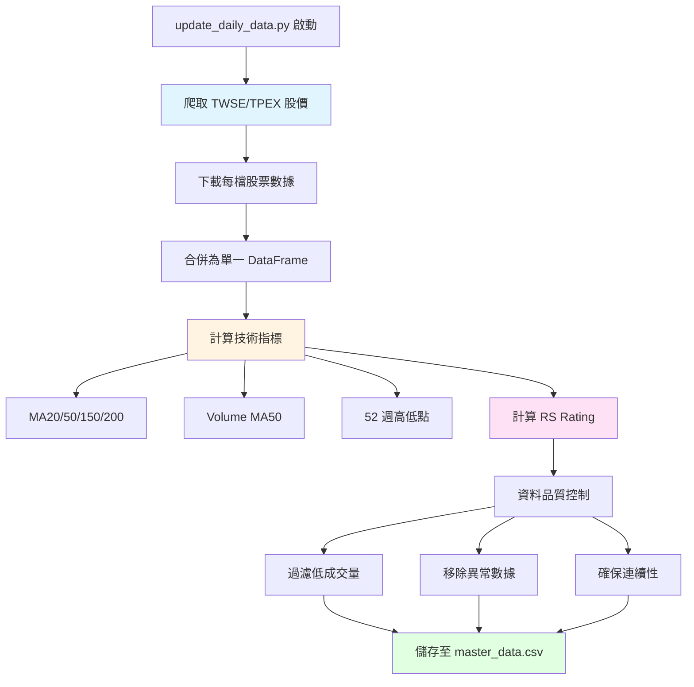

# 數據管道

本文件說明系統的數據來源、更新機制與處理流程。

## 數據來源

系統整合多個數據來源，建立完整的台股數據庫。

### 1. 股價數據

**來源**: Yahoo Finance (via yfinance)

**涵蓋範圍**:
- TWSE 上市股票 (證券交易所)
- TPEX 上櫃股票 (櫃買中心)
- 總計約 1900 檔

**數據欄位**:
- Date: 交易日期
- Open, High, Low, Close: OHLC 價格
- Volume: 成交量
- Adjusted Close: 調整收盤價 (考慮除權息)

**歷史深度**: 通常下載最近 3-5 年數據

### 2. 機構流數據

**來源**: 證交所三大法人買賣超統計

**數據類型**:
- 外資買賣超
- 投信買賣超
- 自營商買賣超

**用途**: 
- 提供機構流特徵 (ML 模型輸入)
- 分析法人動向

**儲存位置**: `data/raw/institutional/`

---

## 數據更新流程

**腳本**: `scripts/update_daily_data.py`

**執行時間**: 每日 19:00 (作為 main.py 的第一步)



### 步驟 1: 股價爬取

**使用 yfinance**:
```python
# 偽代碼示意
for sid in stock_list:
    data = yfinance.download(f'{sid}.TW', period='3y')
    save_to_raw(sid, data)
```

**注意事項**:
- API 限制: 避免過快請求 (加入延遲)
- 錯誤處理: 部分股票可能下載失敗 (記錄並跳過)

### 步驟 2: 技術指標計算

**移動平均線** (MA):
- MA20, MA50, MA150, MA200
- 使用 pandas rolling 計算

**成交量 MA**:
- Volume MA50
- 用於判斷量能變化

**52 週高低點**:
- 過去 252 個交易日 (約 1 年) 的最高/最低價
- 用於 CUP 型態的趨勢模板檢查

### 步驟 3: RS Rating 計算

**相對強度評分**:

**邏輯**:
1. 計算每檔股票的 N 日報酬率 (如 60 日)
2. 計算市場整體 (或指數) 的同期報酬率
3. 比較個股與市場的報酬差異
4. 使用百分位數排名，輸出 0-100 分數

**公式**:
```
stock_return_60d = (close_today / close_60d_ago - 1) × 100
market_return_60d = (market_close_today / market_close_60d_ago - 1) × 100
rs_rating = percentile_rank(stock_return_60d - market_return_60d)
```

**意義**:
- RS Rating = 90: 表示比 90% 的股票強
- RS Rating > 80: 相對強勢
- RS Rating < 20: 相對弱勢

### 步驟 4: 資料品質控制

**過濾規則**:
- 成交量過低 (如 Volume MA50 < 100 張)
- 價格異常 (暴漲暴跌超過正常範圍)
- 數據缺失過多

**資料清理**:
- 填補缺失值 (forward fill / backward fill)
- 移除重複記錄

### 步驟 5: 儲存

**輸出檔案**: `data/processed/master_data.csv`

**格式**:
```
sid, date, open, high, low, close, volume, ma20, ma50, ma150, ma200, volume_ma50, high52, low52, rs_rating
```

**說明**: 所有股票整合為單一 CSV，便於後續型態掃描使用。

---

## 數據處理模組

### src/ml/features.py

**功能**: ML 特徵工程

**函數**: `extract_ml_features`, `calculate_technical_indicators`

**提取特徵**:
- 價格相關: 買入價百分比、停損價百分比、風險百分比
- 成交量: Volume Ratio, Volume Trend
- 動能: Price Change, Momentum, ROC
- RSI: 14 日 RSI, RSI Divergence
- 趨勢: EMA Alignment, Trend Strength, ADX
- 波動: Volatility, ATR
- 市場環境: Near 52W High, Above MA50
- 型態專屬: HTF Grade, CUP Depth, VCP Contractions

### src/data/institutional.py

**功能**: 機構流數據處理

**函數**:
- `load_institutional_raw`: 載入原始三大法人數據
- `compute_institutional_features`: 計算機構流特徵

**特徵**:
- foreign_net_lag1: 外資前一日淨買超
- foreign_net_to_vol_lag1: 外資淨買超佔成交量比
- total_net_lag1: 三大法人總淨買超
- total_net_to_vol_lag1: 總淨買超佔成交量比

### src/utils/data_loader.py

**功能**: 統一數據載入介面

**函數**:
- `load_master_data`: 載入 master_data.csv
- `load_stock_data`: 載入單檔股票時間序列

---

## 數據儲存結構

```
data/
├── raw/                          # 原始數據
│   ├── daily_quotes/             # 每日股價 (按股票分檔)
│   │   ├── 2330.csv
│   │   ├── 2317.csv
│   │   └── ...
│   └── institutional/            # 三大法人數據
│       └── institutional_flow.csv
│
└── processed/                    # 處理後數據
    ├── master_data.csv           # 主數據庫 (所有股票)
    ├── latest_signals.csv        # 最新訊號
    ├── pattern_analysis_result.csv  # 歷史型態分析
    └── backtest_results_v2.csv   # 回測結果
```

---

## 數據更新頻率

| 數據類型 | 更新頻率 | 時間 |
|----------|----------|------|
| 股價數據 | 每日 | 19:00 |
| 技術指標 | 每日 | 19:00 (隨股價更新) |
| RS Rating | 每日 | 19:00 |
| 機構流數據 | 每日 | 19:00 (如果有來源) |
| 型態訊號 | 每日 | 19:00 (掃描後) |
| ML 模型 | 每週 | 週日 02:00 |

---

## 數據驗證

### 完整性檢查
- 每日檢查下載成功的股票數量
- 預期約 1900 檔，若少於 1800 檔則警告

### 一致性檢查
- MA 值應該遞減 (MA20 < MA50 < MA150 < MA200 在下跌趨勢)
- Volume 應該 > 0
- Close 應該在 High 和 Low 之間

### 時效性檢查
- 最新數據日期應為交易日 (非假日)
- 與當前日期相差不超過 1 個工作日

---

## 相關文件

- [基礎策略系統](file:///Users/sony/ml_stock/stock/docs/04_基礎策略系統.md) - 數據更新流程
- [ML Enhanced 系統](file:///Users/sony/ml_stock/stock/docs/05_ML_Enhanced系統.md) - ML 特徵工程
- [CatBoost Enhanced 系統](file:///Users/sony/ml_stock/stock/docs/06_CatBoost_Enhanced系統.md) - CatBoost 特徵工程

## 實作參考

- 數據更新: [scripts/update_daily_data.py](file:///Users/sony/ml_stock/stock/scripts/update_daily_data.py)
- ML 特徵: [src/ml/features.py](file:///Users/sony/ml_stock/stock/src/ml/features.py)
- 機構流: [src/data/institutional.py](file:///Users/sony/ml_stock/stock/src/data/institutional.py)
- 數據載入: [src/utils/data_loader.py](file:///Users/sony/ml_stock/stock/src/utils/data_loader.py)
