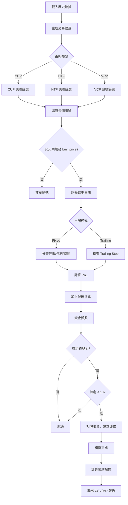

# 回測引擎完整邏輯文檔

## 目錄

1. [系統概述](#系統概述)
2. [策略獨立性驗證](#策略獨立性驗證)
3. [訊號生成與進場邏輯](#訊號生成與進場邏輯)
4. [停損機制](#停損機制)
5. [停利機制](#停利機制)
6. [出場條件總覽](#出場條件總覽)
7. [倉位管理](#倉位管理)
8. [資金控管](#資金控管)
9. [風險控管](#風險控管)
10. [回測流程圖](#回測流程圖)

---

## 系統概述

**檔案位置**: `stock/scripts/run_backtest.py`

**核心功能**: 對 CUP、HTF、VCP 三種技術型態執行獨立回測，測試不同的進出場參數組合，評估策略績效。

**回測期間**: 2023-11-07 至 2025-11-21（約 2 年）

**數據來源**: `data/processed/pattern_analysis_result.csv`（TWSE + TPEX，約 1900 檔股票）

---

## 策略獨立性驗證

### ✅ 完全獨立運作

**關鍵證據**：

```python
# main() 函數中
strategies = ['is_vcp', 'is_htf', 'is_cup']

for s in strategies:
    # 每個策略獨立生成候選交易
    candidates = generate_trade_candidates(df, s, exit_mode, params)
    # 每個策略獨立模擬資金
    executed_trades = run_capital_simulation(candidates, mode='limited')
```

**獨立性保證**：

1. **訊號獨立**：每個策略只讀取自己的欄位
   - CUP: `is_cup`, `cup_buy_price`, `cup_stop_price`
   - HTF: `is_htf`, `htf_buy_price`, `htf_stop_price`
   - VCP: `is_vcp`, `vcp_buy_price`, `vcp_stop_price`

2. **資金池獨立**：每個策略使用獨立的 100 萬初始資金，互不影響

3. **回測結果獨立**：最終的 `backtest_results_v2.csv` 中，每行代表一個策略的獨立績效

**結論**：✅ CUP、HTF、VCP 三個策略**完全獨立**，不會互相干擾。

---

## 訊號生成與進場邏輯

### 訊號來源

訊號由歷史分析腳本 (`run_historical_analysis.py`) 預先生成，存放在 `pattern_analysis_result.csv`。

**訊號篩選條件**：

```python
signals = df.filter(
    (pl.col(strategy) == True) &          # 型態存在
    pl.col(buy_col).is_not_null() &       # 買入價有效
    pl.col(stop_col).is_not_null() &      # 停損價有效
    (pl.col(buy_col) > pl.col(stop_col))  # 買入價 > 停損價（風險合理）
)
```

### 進場點位決定

**進場價格**: `buy_price`（突破價）

**進場條件** (同時滿足):

1. **價格觸發**: 訊號日後的任一天，`high >= buy_price`
2. **追蹤窗口**: 訊號發生後 **30 個交易日內**觸發
3. **首次觸發**: 取第一次觸發的日期

**程式碼實現**：

```python
# 訊號發生後 30 個交易日內
# sig_idx + 31 = sig_idx 之後的 30 個數據點（包含當天後的第一天到第 30 天）
future_end = min(sig_idx + 31, len(high_np))
future_high = high_np[sig_idx + 1 : future_end]  # 從隔日開始

# 找到第一次突破 buy_price 的日期
entry_candidates_idx = np.where(future_high >= buy)[0]
if entry_candidates_idx.size == 0: continue  # 30 天內未觸發，放棄訊號

entry_rel = entry_candidates_idx[0]  # 第一次觸發的相對位置
entry_abs = sig_idx + 1 + entry_rel  # 轉換為絕對位置
entry_date = date_list[entry_abs]
```

**範例場景**：

```
訊號日: 2024-01-01 (sig_idx)
買入價: $100
停損價: $90

Day 1 (01-02): High $98 → 未觸發
Day 5 (01-06): High $102 → ✅ 進場！entry_date = 01-06
Day 31 (02-01): 超過 30 天，此時才突破也不進場
```

**重點**: 追蹤窗口是嚴格的 30 個交易日（不含訊號日）

**關鍵設計**：
- **限價單概念**：等待價格突破才進場，避免追高
- **30 天時效**：超過 30 天未觸發視為訊號失效
- **實際執行價**：進場價 = `buy_price`（假設當天突破即買入）

---

## 停損機制

### 進場當下的停損價

**初始停損**: `stop_price`（型態破壞價）

**來源**: 由型態識別邏輯計算：
- **CUP**: 杯底的最低點
- **HTF**: 旗型整理的最低點
- **VCP**: 近期收縮的最低點

**風險計算**：

```python
risk = buy_price - stop_price
```

**範例**：

```
買入價: $100
停損價: $90
風險: $10 (10%)
```

### 停損觸發條件

在持倉期間，每天檢查 `low <= stop_price`：

```python
# Fixed 模式
stop_hits = np.where(path_low <= stop)[0]
if stop_hits.size > 0:
    exit_abs = entry_abs + int(stop_hits[0])
    pnl = (stop - buy) / buy  # 負報酬
```

**執行價格**: 假設以 `stop_price` 成交

**⚠️ 重要**: 初始停損價在整個持倉期間**固定不變**（Fixed 模式），或根據 Trailing 邏輯動態調整（Trailing 模式）。

---

## 停利機制

系統支援兩種停利模式：**Fixed Target** 和 **Trailing Stop**

### Mode 1: Fixed Target（固定目標）

**參數**：
- `r_mult`: R 倍數（2.0 或 3.0）
- `time_exit`: 時間出場（20 或 60 天）

**目標價計算**：

```python
target = buy_price + risk * r_mult
```

**範例**：

```
買入價: $100
停損價: $90
風險 (R): $10

r_mult = 2.0 → target = $100 + $10 * 2 = $120 (2R)
r_mult = 3.0 → target = $100 + $10 * 3 = $130 (3R)
```

**出場邏輯**：

1. **目標價優先**: 先觸及目標價 → 獲利出場
2. **停損優先**: 先觸及停損價 → 停損出場
3. **時間出場**: 均未觸及且持倉達 `time_exit` 天 → 以當天收盤價出場

**程式碼實現**：

```python
# 檢查路徑中的價格
path_end = min(entry_abs + time_exit, len(high_np))
path_high = high_np[entry_abs:path_end]
path_low = low_np[entry_abs:path_end]

# 找到第一次觸及點
stop_hits = np.where(path_low <= stop)[0]
target_hits = np.where(path_high >= target)[0]

stop_i = stop_hits[0] if stop_hits.size > 0 else np.inf
target_i = target_hits[0] if target_hits.size > 0 else np.inf

# 比較誰先發生
if stop_i < target_i:
    # 先停損
    exit_date = entry_abs + int(stop_i)
    pnl = (stop - buy) / buy
elif target_i < stop_i:
    # 先停利
    exit_date = entry_abs + int(target_i)
    pnl = (target - buy) / buy
else:
    # 時間出場
    exit_date = path_end - 1
    pnl = (close[exit_date] - buy) / buy
```

### Mode 2: Trailing Stop（移動停損）

**參數**：
- `trigger_r`: 啟動倍數（1.5R 或 2.0R）
- `trail_ma`: 追蹤均線（ma20 或 ma50）

**運作邏輯**：

**階段 1: 未啟動** (`current_stop = stop_price`)
- 等待價格觸及 `trigger_price = buy + risk * trigger_r`
- 若觸及，進入階段 2

**階段 2: 已啟動** (`trailing_active = True`)
- 停損價跟隨均線：`current_stop = max(current_stop, MA)`
- 均線上升 → 停損價上升（鎖定利潤）
- 均線下降 → 停損價不變（保護已實現利潤）

**出場條件**：
- `low <= current_stop` → 出場

**程式碼實現**：

```python
trigger_price = buy + risk * params['trigger_r']
current_stop = stop
trailing_active = False

for k in range(len(path_high)):
    h = path_high[k]
    l = path_low[k]
    c = path_close[k]
    m = path_ma[k]  # MA20 或 MA50
    
    # 檢查是否啟動 Trailing
    if not trailing_active:
        if h >= trigger_price:
            trailing_active = True
            current_stop = max(current_stop, m)
    else:
        # 已啟動，跟隨 MA
        current_stop = max(current_stop, m)
    
    # 檢查是否跌破停損
    if l <= current_stop:
        exit_abs = entry_abs + k
        pnl = (current_stop - buy) / buy
        break
```

**範例場景**：

```
買入價: $100, 停損: $90, Risk: $10
trigger_r = 1.5 → trigger_price = $115

Day 1: High $110, MA20 $95 → 未啟動，current_stop = $90
Day 5: High $120, MA20 $105 → ✅ 啟動！current_stop = $105
Day 10: High $125, MA20 $110 → current_stop = $110 (跟隨上升)
Day 15: Low $108, MA20 $112 → ✅ 跌破停損 $110，出場
```

---

## 出場條件總覽

| 出場原因 | Fixed模式 | Trailing模式 | 執行價格 |
|---------|-----------|--------------|----------|
| **停損** | ✅ `low <= stop_price` | ✅ `low <= current_stop` | stop_price / current_stop |
| **停利** | ✅ `high >= target` | ❌ N/A | target |
| **時間** | ✅ 持倉達 `time_exit` 天 | ❌ N/A | close_price |
| **追蹤停損** | ❌ N/A | ✅ 跌破 MA | current_stop |

**優先順序** (Fixed 模式):

```
停損/停利（誰先發生） > 時間出場
```

**Unlimited vs Limited 模式的影響**：
- 出場邏輯完全相同
- 差異僅在資金分配（下一節說明）

---

## 倉位管理

### 倉位大小計算

**動態倉位** (基於當前總資產):

```python
total_equity = current_cash + sum(active_positions['cost'])
position_size = total_equity * POSITION_SIZE_PCT  # 10%
```

**關鍵特性**：
- **複利效應**: 隨著獲利增加，每個新部位的大小也增加
- **固定比例**: 始終維持在總資產的 10%

**範例**：

```
Day 1: Total Equity = 100萬 → Position Size = 10萬
Day 100: Total Equity = 150萬 → Position Size = 15萬 (複利!)
```

### 最大持倉限制

```python
MAX_POSITIONS = 10
```

- 同時最多持有 **10 個部位**
- 超過 10 個時，新訊號被忽略（即使有現金）

### Pyramiding（加碼）

**當前設定**: ✅ **允許 Pyramiding**

```python
# 進場檢查（已移除 No Pyramiding 限制）
if len(active_positions) < MAX_POSITIONS and current_cash >= position_size:
    # 進場！
```

**意義**：
- 同一股票可以**多次進場**
- 不同訊號日期的同一股票視為**獨立部位**

**範例場景**：

```
Stock A:
  訊號 1 (2024-01-05): 買入 10萬
  訊號 2 (2024-01-20): 買入 11萬 (允許！)
  → 同時持有 Stock A 的 2 個部位
```

**風險**:
- 可能對單一股票高度集中
- 若該股下跌，影響放大

---

## 資金控管

### 初始資金

```python
INITIAL_CAPITAL = 1_000_000  # 100萬
```

### 現金流管理

**進場時**：

```python
if current_cash >= position_size:
    current_cash -= position_size  # 扣除現金
    # 記錄部位資訊
    position = {
        'entry_date': entry_date,
        'entry_price': buy_price,
        'size': position_size,
        'cost': position_size
    }
```

**出場時** (T+0 假設):

```python
# 計算損益
profit = position_size * (exit_price - entry_price) / entry_price
return_cash = position_size + profit  # 本金 + 損益
current_cash += return_cash  # 立即回收
```

**資金檢查**：
- ✅ 每次進場前**必須**檢查現金是否足夠
- ✅ 不允許負現金（已驗證，整個回測期間無負現金）

### FIFO 資金分配原則

**先進先出邏輯**：當同一日期有多個訊號，按進場時間順序分配資金。

```python
# 進場候選訊號按 entry_date 排序（FIFO）
candidates.sort(key=lambda x: x['entry_date'])

# 資金分配順序
for candidate in sorted_candidates:
    if current_cash >= position_size and len(active_positions) < MAX_POSITIONS:
        execute_trade(candidate)
```

**實務含義**：
- 確保優先滿足最早進場的機會
- 資金分配順序公平，避免遺漏時間敏感的訊號

### 資金利用率

**計算公式**：

```python
invested = sum(active_positions['cost'])  # 已投入資本
total_equity = invested + current_cash    # 總資產
capital_utilization = invested / INITIAL_CAPITAL * 100%
```

**正常範圍**：
- 無 Pyramiding: 約 100%
- 有 Pyramiding: 可能超過 100%（因為複利增加總資產）

**當前實測**：
- 平均資金利用率: **148.8%** (允許 Pyramiding + 複利效應)
- **複利效應解釋**: 隨著獲利增加，每次進場的部位大小也隨之增加，導致總投入資本超過初始資金

---

## 風險控管

### 單筆交易風險

**計算**：

```python
risk = buy_price - stop_price
risk_pct = risk / buy_price * 100
```

**固定 R**: 每筆交易的初始風險由型態決定（通常 5-15%）

### 總風險暴露

**最大風險** (理論):

```python
max_risk = MAX_POSITIONS * POSITION_SIZE_PCT = 10 * 10% = 100%
```

實際風險遠低於 100%，因為：
1. 部位會陸續出場釋放資金
2. 停利會鎖定利潤

### 回測驗證的風險指標

1. **最大回撤 (MDD)**：
   - CUP ML 0.5: **-11.8%**
   - HTF Trailing: **-30.9%**

2. **勝率**：
   - CUP ML 0.5: **74.6%**
   - HTF Trailing: **38.7%**

3. **Sharpe Ratio**：
   - CUP ML 0.5: **3.13** (優秀)
   - HTF Trailing: **1.19** (合格)

---

## 回測流程圖



---

## 關鍵參數總覽

| 參數 | 值 | 說明 |
|------|---|----|
| `INITIAL_CAPITAL` | 100萬 | 初始資金 |
| `MAX_POSITIONS` | 10 | 最大持倉數 |
| `POSITION_SIZE_PCT` | 10% | 單筆部位佔總資產比例 |
| **進場** |  |  |
| 追蹤窗口 | 30 天 | 訊號後多久內有效 |
| 進場價 | buy_price | 突破價 |
| **Fixed 模式** |  |  |
| r_mult | 2.0 / 3.0 | 停利倍數 |
| time_exit | 20 / 60 | 時間出場（天） |
| **Trailing 模式** |  |  |
| trigger_r | 1.5 / 2.0 | 啟動追蹤倍數 |
| trail_ma | ma20 / ma50 | 追蹤均線 |
| **Pyramiding** | ✅ 允許 | 同股票可多次進場 |

---

## 測試的策略組合

回測系統測試了 **24 種策略組合** (每個型態 8 種):

**Fixed 模式** (12 種組合):
- 3 個型態 × 2 個 R 倍數 × 2 個時間出場 = 12

**Trailing 模式** (12 種組合):
- 3 個型態 × 2 個啟動倍數 × 2 個追蹤均線 = 12

**總計**: 24 種策略（3 型態 × 8 參數組合）

每個策略**完全獨立**運行，使用各自的 100 萬初始資金。

---

## 驗證清單

✅ **策略獨立性**: CUP/HTF/VCP 使用獨立資金池，互不干擾
✅ **進場點位**: 30天內首次突破 buy_price
✅ **初始停損**: stop_price (型態破壞價)
✅ **停利機制**: Fixed Target 或 Trailing Stop
✅ **時間出場**: Fixed 模式下持倉達上限自動出場
✅ **倉位管理**: 總資產 10%，最多 10 個部位
✅ **資金控管**: T+0 回收，無負現金
✅ **風險控管**: 最大持倉限制，MDD 監控
✅ **Pyramiding**: 允許同股票多次進場

---

**文檔版本**: 1.0  
**最後更新**: 2025-11-21  
**對應程式碼**: `stock/scripts/run_backtest.py`
