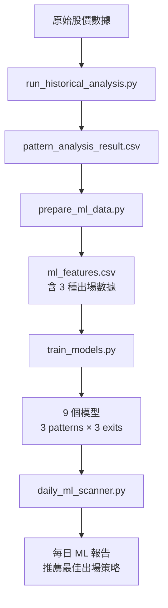

# ML 系統邏輯詳細文檔

**文檔版本**: 2.0  
**最後更新**: 2025-11-22  
**關聯**: [ML Overview](./overview.md)

---

## 目錄
1. [系統架構總覽](#系統架構總覽)
2. [數據流程](#數據流程)
3. [特徵工程詳解](#特徵工程詳解)
4. [模型訓練](#模型訓練)
5. [預測與部署](#預測與部署)

---

## 系統架構總覽

### 核心組件



### 目錄結構

```
ml_enhanced/
├── data/
│   └── ml_features.csv          # ML 訓練數據（特徵 + 標籤 × 3 exits）
├── models/
│   ├── stock_selector_cup_fixed_r2_t20.pkl
│   ├── stock_selector_cup_fixed_r3_t20.pkl
│   ├── stock_selector_cup_trailing_15r.pkl
│   ├── stock_selector_htf_fixed_r2_t20.pkl
│   ├── stock_selector_htf_fixed_r3_t20.pkl
│   ├── stock_selector_htf_trailing_15r.pkl
│   ├── stock_selector_vcp_fixed_r2_t20.pkl
│   ├── stock_selector_vcp_fixed_r3_t20.pkl
│   ├── stock_selector_vcp_trailing_15r.pkl
│   └── feature_info.pkl         # 特徵元數據
├── scripts/
│   ├── prepare_ml_data.py       # 特徵工程腳本（多出場）
│   ├── train_models.py          # 模型訓練腳本（9 個模型）
│   └── run_ml_backtest.py       # ML 回測驗證
├── daily_ml_scanner.py          # 每日 ML 掃描器（多策略推薦）
└── weekly_retrain.py            # 每週模型再訓練
```
> 文檔搬遷至 `docs/ml/`，程式與報告仍位於 `ml_enhanced/`。

---

## 數據流程

### 完整數據管線

#### **階段 1: 型態偵測與歷史分析**

**腳本**: [`run_historical_analysis.py`](../../scripts/run_historical_analysis.py)

**功能**: 掃描所有股票，識別 HTF/CUP/VCP 型態並記錄買賣點

**輸入**:
- 原始股價數據（TWSE + TPEX，約 1900 檔）
- 126 天滾動窗口

**處理流程**:
1. 計算技術指標:
   - MA50, MA150, MA200
   - 52 週低點 (low52)
   - 成交量 MA50
   - RS Rating (相對強度評級)
   - 52 週高點 (high_52w)

2. 型態偵測（每個股票每日）:
   ```python
   # HTF 偵測
   is_htf, htf_buy, htf_stop, htf_grade = detect_htf(window, rs_rating)
   
   # CUP 偵測
   is_cup, cup_buy, cup_stop = detect_cup(window, ma_info, rs_rating)
   
   # VCP 偵測
   is_vcp, vcp_buy, vcp_stop = detect_vcp(window, vol_ma50, ma50, rs_rating, high_52w)
   ```

3. 計算未來報酬 (Forward Return Evaluation):
   ```python
   # 評估訊號後的結果
   vcp_2R, vcp_3R, vcp_4R, vcp_stop_hit = eval_R_outcome(g, i, vcp_buy, vcp_stop)
   htf_2R, htf_3R, htf_4R, htf_stop_hit = eval_R_outcome(g, i, htf_buy, htf_stop)
   cup_2R, cup_3R, cup_4R, cup_stop_hit = eval_R_outcome(g, i, cup_buy, cup_stop)
   ```

**輸出**: `data/processed/pattern_analysis_result.csv`

**欄位**:
```
sid, date, volume, dd, high, low, close, change_pct,
is_vcp, vcp_buy_price, vcp_stop_price, vcp_2R, vcp_3R, vcp_4R, vcp_stop,
is_htf, htf_buy_price, htf_stop_price, htf_grade, htf_2R, htf_3R, htf_4R, htf_stop,
is_cup, cup_buy_price, cup_stop_price, cup_2R, cup_3R, cup_4R, cup_stop
```

---

#### **階段 2: 特徵工程**

**腳本**: [`prepare_ml_data.py`](../scripts/prepare_ml_data.py)

**功能**: 為每個型態訊號計算 ML 特徵並生成標籤

**輸入**:
- `pattern_analysis_result.csv`（來自階段 1）

**處理流程**:

1. **載入數據並計算技術指標**:
   ```python
   # 使用 calculate_technical_indicators
   df_pd = df_pd.groupby('sid').apply(calculate_technical_indicators)
   ```

2. **對每個型態（HTF/CUP/VCP）分別處理**:
   ```python
   for pattern_type in ['htf', 'cup', 'vcp']:
       signals = df_pd[df_pd[f'is_{pattern_type}'] == True]
       
       # 生成標籤
       labels = generate_labels(df_pd, pattern_type)
       
       # 提取特徵
       for idx, row in signals.iterrows():
           features = extract_ml_features(row, pattern_type)
           features['is_winner'] = labels.get((sid, date), {}).get('is_winner', 0)
   ```

3. **標籤生成邏輯（多出場方式）** ([`generate_labels`](../scripts/prepare_ml_data.py)):

   **NEW**: 每個訊號計算 **3 種出場方式**的表現：
   - `fixed_r2_t20`: Fixed R=2.0, T=20
   - `fixed_r3_t20`: Fixed R=3.0, T=20
   - `trailing_15r`: Trailing Stop (1.5R trigger, MA20)

   **Score 計算**:
   ```python
   # 為每種出場方式模擬交易
   for exit_mode in ['fixed_r2_t20', 'fixed_r3_t20', 'trailing_15r']:
       if exit_mode.startswith('fixed'):
           pnl, duration = simulate_trade_fixed(data, buy, stop, r_mult, time_exit)
       else:
           pnl, duration = simulate_trade_trailing(data, buy, stop, trigger_r)
       
       # 計算資金效率分數
       score = (pnl * 100) / duration
   ```

   **分級邏輯（獨立分級）**:
   - 每種出場方式計算自己的分位數 (q25, q50, q75)
   - A級: Score ≥ q75 (前 25%)
   - B級: q50 ≤ Score < q75
   - C級: q25 ≤ Score < q50
   - D級: Score < q25
   - `is_winner = 1` if grade in ['A', 'B'] else 0

**輸出**: `ml_enhanced/data/ml_features.csv`

**欄位**:
- Metadata: `sid`, `date`, `pattern_type`, `exit_mode`, `buy_price`, `stop_price`
- Features: 24 個特徵（每個訊號相同，exit_mode 不同）
- Labels: `actual_return`, `duration`, `score`, `label_abcd`, `is_winner`

**數量**: 原本 N 個訊號 → 現在 N × 3 行 (每個訊號 3 種出場方式)

---

#### **階段 3: 模型訓練**

**腳本**: [`train_models.py`](../scripts/train_models.py)

**功能**: 訓練 **9 個 XGBoost 模型**（3 patterns × 3 exit modes）

**輸入**: `ml_features.csv` (含 exit_mode 欄位)

**訓練邏輯**:
```python
for pattern in ['cup', 'htf', 'vcp']:
    for exit_mode in ['fixed_r2_t20', 'fixed_r3_t20', 'trailing_15r']:
        # 過濾該組合的數據
        data = df[(df['pattern_type'] == pattern.upper()) & 
                  (df['exit_mode'] == exit_mode)]
        
        # 訓練模型
        model = train_stock_selector(data)
        
        # 儲存
        save_model(model, f'stock_selector_{pattern}_{exit_mode}.pkl')
```

**輸出**: 9 個模型檔案 + `feature_info.pkl`

---

#### **階段 4: 每日掃描與預測**

**腳本**: [`daily_ml_scanner.py`](../daily_ml_scanner.py)

**功能**: 每日掃描股票並應用 ML 模型過濾

**流程**:
1. 更新每日數據
2. 載入 ML 模型
3. 掃描最新日期的股票（即時計算特徵）
4. ML 模型預測勝率
5. 生成報告（推薦 ML ≥ 0.4 的訊號）

---

## 特徵工程詳解

### 特徵列表（24 features）

- **型態品質 (3)**:
  - `grade_numeric`: HTF 的分級評分（A=3, B=2, C=1；CUP/VCP 預設 2）
  - `distance_to_buy_pct`: 當前價格距離突破價的百分比差距
  - `risk_pct`: 風險百分比 = (buy_price - stop_price) / buy_price × 100

- **成交量 (4)**:
  - `volume_ratio_ma20`: 當日成交量 / MA20 成交量
  - `volume_ratio_ma50`: 當日成交量 / MA50 成交量
  - `volume_surge`: 是否爆量的二值指標
  - `volume_trend_5d`: 5 日成交量趨勢

- **動能 (4)**:
  - `momentum_5d`: 5 日價格動能 (%) = (close[t] - close[t-5]) / close[t-5]
  - `momentum_20d`: 20 日價格動能 (%)
  - `price_vs_ma20`: 收盤價相對 MA20 位置 (%)
  - `price_vs_ma50`: 收盤價相對 MA50 位置 (%)

- **RSI (2)**:
  - `rsi_14`: 14 期 EMA 版 RSI（資料不足時回退 50）
  - `rsi_divergence`: 20 日新高但 RSI 未創新高的背離指標

- **技術面 (3)**:
  - `ma_trend`: MA20 > MA50 的布林值（上升趨勢）
  - `volatility`: 20 日報酬率的標準差
  - `atr_ratio`: 真實波幅比 = 14 日 High-Low 平均 / Close

- **市場環境 (2)**:
  - `market_trend`: 加權指數收盤 > MA200 的布林值
  - `market_volatility`: 來自 `market_data.csv` 的市場波動度（缺值回退 0.02）

- **相對強弱 (1)**:
  - `rs_rating`: 相對強度評級 = 全市場 52 週報酬率百分位

- **型態專屬 (1)**:
  - `consolidation_days`: 整理天數（CUP/VCP 預設 10）

- **訊號密度 (2)** ⚠️ **未實現**:
  - `signal_count_ma10`: 10 日內訊號計數（目前為 placeholder=0，待實現）
  - `signal_count_ma60`: 60 日內訊號計數（目前為 placeholder=0，待實現）

> `pattern_type`, `buy_price`, `stop_price` 會保留在 `ml_features.csv` 方便分析，但不在 `FEATURE_COLS` 內供模型訓練。

### 計算重點
- `calculate_technical_indicators` 現在要求 volume 存在，缺少會拋錯，避免模型吃到假數據。`run_historical_analysis.py` 已把 volume 寫入 `pattern_analysis_result.csv`。
- Volume 特徵使用實際滾動均量與 5 日趨勢，不再有 1.0/0 的預設值。
- RSI 改為標準 EMA 版計算並用 20 日高點檢查背離；資料不足時以 50 作中性補值。
- `market_trend` / `market_volatility` 從 `data/raw/market_data.csv` 取得，缺資料時回退 1 / 0.02。
- 動能特徵使用 5/20 日漲幅，`price_vs_ma20/50` 直接比較收盤與均線。

### `ml_features.csv` 欄位
- **Metadata**: `sid`, `date`, `pattern_type`, `exit_mode`, `buy_price`, `stop_price`
- **24 Features**: 依上方列表
- **Labels**: `actual_return`, `duration`, `score`, `label_abcd`, `is_winner`
- **範例**:
  ```
  sid,date,pattern_type,exit_mode,score,is_winner,...
  2330,2024-01-01,HTF,fixed_r2_t20,2.5,1,...
  2330,2024-01-01,HTF,fixed_r3_t20,1.8,1,...
  2330,2024-01-01,HTF,trailing_15r,3.2,1,...
  ```

---

## 模型訓練

### Stock Selector（股票選擇模型）

**目的**: 預測該訊號是否為 "Winner"（未來 20 天漲幅 > 10%）

**算法**: XGBoost Classifier

**參數** ([`train_models.py`](../scripts/train_models.py#L121-L130)):
```python
XGBClassifier(
    n_estimators=200,      # 200 棵樹
    max_depth=5,           # 最大深度 5
    learning_rate=0.05,    # 學習率 0.05
    subsample=0.8,         # 80% 樣本採樣
    colsample_bytree=0.8,  # 80% 特徵採樣
    random_state=42
)
```

**訓練流程**:

1. **時間序列分割** ([`time_based_split`](../scripts/train_models.py#L92-L103)):
   ```python
   # 80% 訓練集（早期數據）
   # 20% 測試集（晚期數據）
   split_idx = int(len(df) * 0.8)
   train_df = df.iloc[:split_idx]
   test_df = df.iloc[split_idx:]
   ```

2. **訓練 & 評估**:
   ```python
   model.fit(X_train, y_train, eval_set=[(X_test, y_test)])
   ```

3. **性能指標**:
   - **ROC AUC**: ~0.73
   - **準確率**: ~75% (在 threshold=0.4 下)
   - **Recall**: 50-60%
   - **Precision**: 70-80%

4. **閾值分析** ([`train_models.py`](../scripts/train_models.py#L162-L176)):
   ```python
   Threshold 0.5: Precision 75%, Recall 45%, Selected 25%
   Threshold 0.6: Precision 80%, Recall 30%, Selected 15%
   Threshold 0.7: Precision 85%, Recall 20%, Selected 8%
   ```

**決策閾值**: **0.4** (平衡準確率與覆蓋率)

**解讀**:
- ML Prob ≥ 0.4 → 推薦訊號（勝率 70-78%）
- ML Prob 0.3-0.4 → 中等訊號（勝率 60-70%）
- ML Prob < 0.3 → 低品質訊號（勝率 < 60%）

---

### Position Sizer（倉位分配模型）

**目的**: 預測該訊號的預期報酬率

**算法**: XGBoost Regressor

**參數**: 與 Stock Selector 相同

**性能指標**:
- **RMSE**: ~0.08 (8% 誤差)
- **R² Score**: ~0.45
- **Correlation**: ~0.65

**用途**: 
- 未來可用於動態倉位分配（高預期報酬 → 大倉位）
- 目前尚未實作於每日掃描中

---

## 預測與部署

### 每日 ML 掃描流程

**腳本**: [`daily_ml_scanner.py`](../daily_ml_scanner.py)

**執行時間**: 每日 19:05 (Crontab)

**完整流程**:

#### 1. 更新數據
```python
update_data()  # 更新 TWSE + TPEX 股價
```

#### 2. 載入模型
```python
models, feature_cols = load_all_ml_models()
# models: 包含 9 個模型的 dict
# {'cup_fixed_r2_t20': model1, 'cup_fixed_r3_t20': model2, ...}
```

#### 3. 掃描股票
```python
for sid in latest_stocks:
    # 取得 126 天窗口
    window = stock_df.iloc[i - 126 + 1 : i + 1]
    
    # 偵測型態
    is_htf, htf_buy, htf_stop, htf_grade = detect_htf(window, rs_rating)
    
    if is_htf:
        # 即時計算特徵
        features = extract_ml_features(row_today, 'htf')
        
        # **NEW: 預測 3 種出場方式**
        best_exit, best_ml_score, all_preds = predict_best_exit(
            models, feature_cols, features, 'htf'
        )
        # all_preds = {
        #     'fixed_r2_t20': 0.82,
        #     'fixed_r3_t20': 0.65,
        #     'trailing_15r': 0.71
        # }
        # best_exit = 'fixed_r2_t20'  # ML 分數最高的策略
        # best_ml_score = 0.82
        
        # 過濾: ML >= 0.4
        if best_ml_score >= 0.4:
            推薦訊號 (顯示推薦策略)
        else:
            原始訊號（僅供參考）
```

#### 4. 生成報告
**輸出**: `ml_enhanced/daily_reports/YYYY-MM-DD/ml_daily_summary.md`

**內容**:
- ✅ ML 推薦訊號 (ML ≥ 0.4)
  - **NEW**: 顯示推薦出場策略 (例如: Fixed R=2.0)
  - 顯示所有 3 種策略的 ML 分數
- 📅 過去一週訊號彙整
- 🏆 Top 3 Strategies (基於最新回測結果)
- 📖 交易策略說明 (**動態更新**，從回測結果讀取)

---

### 每週模型再訓練

**腳本**: [`weekly_retrain.py`](../weekly_retrain.py)

**執行時間**: 每週日 02:00 (Crontab)

**流程**:
```bash
1. prepare_ml_data.py   # 重新生成 ml_features.csv (含多出場數據)
2. train_models.py      # 重新訓練 9 個模型
3. run_ml_backtest.py   # 驗證新模型績效 (選用)
```

**目的**: 確保模型適應最新市場行為，動態調整分級標準

---

## 模型性能驗證

### 回測績效 (2025-11-22)

**最佳策略**: HTF Fixed R=2.0 (ML 0.4)

| 指標 | 數值 |
|------|------|
| 年化報酬 | **156.0%** |
| Sharpe Ratio | **2.59** |
| 勝率 | **60.2%** |
| 最大回撤 | -14.4% |
| 平均持倉天數 | 9.9 天 |
| 交易次數 | 425 |

**其他優秀策略**:
- HTF Fixed R=2.0 (ML 0.5): 年化 145.7%, Sharpe 2.62, 勝率 62.8%
- CUP Fixed R=3.0 (ML 0.5): 年化 129.7%, Sharpe 2.09, 勝率 74.4%

### ML 模型表現

**9 個模型 ROC AUC 範圍**: 0.55 - 0.63
- HTF 模型表現最佳 (AUC > 0.62)
- CUP Trailing 優於 Fixed
- 所有模型均優於隨機 (0.5)

---

## 系統改進歷程

### ✅ 已完成 (v2.0)

1. **多出場方式 ML 系統** (2025-11-22):
   - 每個訊號計算 3 種出場策略的表現
   - 訓練 9 個獨立模型 (3 patterns × 3 exits)
   - 自動推薦最佳出場方式
   - 報告動態更新回測數據

2. **實作真實 RSI 計算**:
   - 14 期 EMA 版 RSI
   - 20 日高點背離檢測

3. **實作真實市場趨勢**:
   - 基於加權指數 (TAIEX) 計算
   - 從 `market_data.csv` 讀取

4. **新增成交量特徵**:
   - `volume_ratio_ma20`, `volume_ratio_ma50`
   - `volume_surge`, `volume_trend_5d`

5. **新增動量特徵**:
   - `momentum_5d`, `momentum_20d`
   - `price_vs_ma20`, `price_vs_ma50`

6. **交易成本與滑點**:
   - 手續費 0.1% (買賣)
   - 交易稅 0.3% (賣出)
   - 1-tick 滑點

### 中優先級

7. **實作訊號計數**:
   - 當前: 固定值 0
   - 目標: 真實訊號密度統計

8. **新增型態強度特徵**:
   - `consolidation_days`: 盤整天數 (部分實作)
   - `breakout_gap`: 突破缺口百分比

9. **倉位分配模型整合**:
   - 目前已訓練但未使用
   - 可用於動態倉位管理

---

## 參考連結

- [ML Overview](./overview.md)
- [Feature Extraction Code](../../src/ml/features.py)
- [Model Training Code](../scripts/train_models.py)
- [Data Preparation Code](../scripts/prepare_ml_data.py)
- [Pattern Detection Strategies](../../src/strategies/)
- [Daily ML Scanner](../daily_ml_scanner.py)

---

**撰寫日期**: 2025-11-22  
**作者**: ML Stock Selection System  
**版本**: 2.0 (Multi-Exit ML System)
